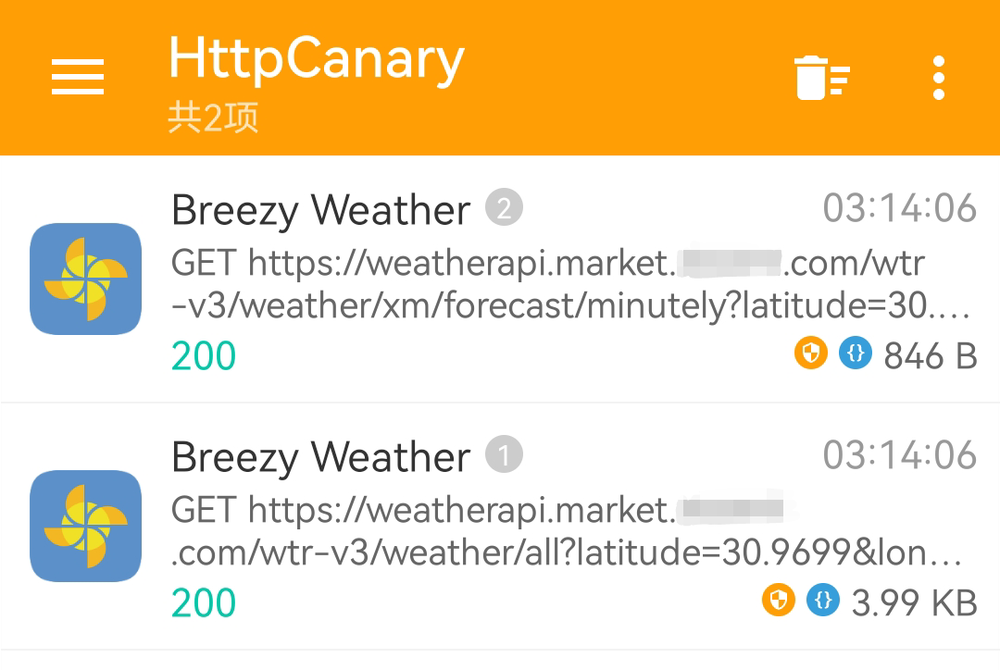

# 高版本 Android 设备无 Root 抓包 HTTPS 明文的简单解决方案

自 Android 7.0 起，系统不再信任用户安装的 CA 证书，这使得原有的 HTTPS 抓包手段在多数应用中不再有效。
解决该问题最直接的方式是将抓包工具提供的 CA 证书安装到系统证书目录，但这通常需要 Root 权限。
然而，目前多数主流品牌的设备已不再向普通用户提供 Root 通道，
甚至于以往支持 Root 的厂商近期也正逐步收紧对 Root 的开放策略，这使得获取 Root 权限愈发困难。
另一种替代思路是借助已 Root 的虚拟机环境，但这类方案不仅占用大量存储空间，还难以完整还原真机的运行环境，容易被应用检测并拒绝运行。
那在这样的背景下，是否存在一种适用于高版本安卓、无需额外设备、无需 Root、且能够有效捕获 HTTPS 明文的简单方法？

<!-- more -->

## 方法原理

每一个安卓应用可以通过修改 `AndroidManifest.xml` 中 `#!xml <application>` 的 `android:networkSecurityConfig`
来指定一个配置文件，用于调整自身的[网络安全配置](https://developer.android.google.cn/privacy-and-security/security-config?hl=zh-cn)。

通过这种方式，我们能够自定义信任锚，即自定义哪些证书授权机构 (CA) 值得信赖，从而使应用能够信任抓包工具的证书。

## 演示环境

!!! warning "免责声明"

    本文所涉及的技术、工具及示例仅用于学习和研究目的，不得将上述内容用于商业或者非法用途，
    否则，一切因不当使用本文信息而造成的任何后果由使用者自行承担！

| 名称 | 版本 | 备注  |
| --- | --- | --- |
| 手机系统 | 鸿蒙 `3.0.0` | `ro.build.version.sdk=29` |
| HttpCanary | `3.3.6` | 安卓老牌抓包工具，现更名为 [Reqable](https://reqable.com/zh-CN) |
| [MT 管理器](https://mt2.cn) | `2.18.4`（需要 VIP） | 也可以用其他能够修改 APK 的工具替代，如：[Apktool M](https://maximoff.su/apktool) |
| [Breezy Weather](https://github.com/breezy-weather/breezy-weather) | `6.0.11-rc` | 本次演示所使用的教具 |
| [OctoDroid](https://github.com/slapperwan/gh4a) | `4.6.13` | 也是本次演示所使用的教具 |

## 操作步骤

话不多说，我们立即开始实战！但是在开始之前，我们回想一下刚刚介绍的原理：
有些应用可能已经设置过了自己的网络安全配置文件，此时我们可以直接找到并修改它；
反之也有可能应用没有设置。
这两种情况的操作方式会有一点点的不同。

### 修改原有配置文件

这种情况的操作会简单不少，这里就以应用 Breezy Weather 举例。首先我们查看这个应用的 `AndroidManifest.xml`：

<style>
    .md-content img {
        border-radius: .1rem;
    }
</style>
<div class="grid" markdown>


</div>

这里能看到 `#!xml <application>` 中 `android:networkSecurityConfig` 已经被定义，
然后我们查询资源的值以定位到配置文件在 APK 中的位置并编辑：


这里我们修改了第 3 行的 [`cleartextTrafficPermitted`](https://developer.android.google.cn/privacy-and-security/security-config?hl=zh-cn#CleartextTrafficPermitted)
为 `#!js "true"`，表示允许明文流量。  
然后还在第 9 行处添加了：
```xml linenums="9"
<certificates src="user" />
```
这表示应用会信任用户来源的 CA 证书。

最后，我们回编译应用，安装后再抓包。看，我们成功了！


### 添加新的配置文件

并不是每个应用都定义了网络安全配置文件，比如我们这里用来演示的应用 —— OctoDroid。

此时我们可以先来到 APK 根目录的 `res` 文件夹，然后随便复制个 `xml`
文件并重命名为 `my_network_security_config.xml`，最后把文件内容全部替换：
```xml linenums="1"
<?xml version="1.0" encoding="utf-8"?>
<network-security-config>
    <base-config cleartextTrafficPermitted="true">
        <trust-anchors>
            <certificates src="system" />
            <certificates src="user" />
        </trust-anchors>
    </base-config>
</network-security-config>
```

> 至于为什么要绕这么一圈而不是直接在外部创建一个新的 XML 文件并添加到 APK。
> 这是因为 `APK` 内的 XML 实际上都被[编译](https://developer.android.google.cn/tools/aapt2?hl=zh-cn)为了[二进制文件（AXML）](https://cs.android.com/android/platform/superproject/main/+/main:frameworks/base/libs/androidfw/include/androidfw/ResourceTypes.h;drc=61197364367c9e404c7da6900658f1b16c42d0da;l=841)，并不是以明文存储。
> 如果你真的想试试会发生什么，我已经帮你试过了，这会触发报错：
> 
> ??? note "日志有点长，请点击展开查看"
> 
>     ```
>     E AndroidRuntime: FATAL EXCEPTION: main
>     E AndroidRuntime: Process: com.gh4a, PID: 15814
>     E AndroidRuntime: java.lang.ExceptionInInitializerError
>     E AndroidRuntime:        at com.gh4a.ServiceFactory.<clinit>(ServiceFactory.java:110)
>     E AndroidRuntime:        at com.gh4a.ServiceFactory.initClient(ServiceFactory.java:212)
>     E AndroidRuntime:        at com.gh4a.Gh4Application.onCreate(Gh4Application.java:124)
>     E AndroidRuntime:        at android.app.Instrumentation.callApplicationOnCreate(Instrumentation.java:1202)
>     E AndroidRuntime:        at android.app.ActivityThread.handleBindApplication(ActivityThread.java:7601)
>     E AndroidRuntime:        at android.app.ActivityThread.access$2600(ActivityThread.java:259)
>     E AndroidRuntime:        at android.app.ActivityThread$H.handleMessage(ActivityThread.java:2440)
>     E AndroidRuntime:        at android.os.Handler.dispatchMessage(Handler.java:110)
>     E AndroidRuntime:        at android.os.Looper.loop(Looper.java:219)
>     E AndroidRuntime:        at android.app.ActivityThread.main(ActivityThread.java:8673)
>     E AndroidRuntime:        at java.lang.reflect.Method.invoke(Native Method)
>     E AndroidRuntime:        at com.android.internal.os.RuntimeInit$MethodAndArgsCaller.run(RuntimeInit.java:513)
>     E AndroidRuntime:        at com.android.internal.os.ZygoteInit.main(ZygoteInit.java:1109)
>     E AndroidRuntime: Caused by: java.lang.RuntimeException: Failed to parse XML configuration from my_network_security_config
>     E AndroidRuntime:        at android.security.net.config.XmlConfigSource.ensureInitialized(XmlConfigSource.java:89)
>     E AndroidRuntime:        at android.security.net.config.XmlConfigSource.getPerDomainConfigs(XmlConfigSource.java:55)
>     E AndroidRuntime:        at android.security.net.config.ManifestConfigSource.getPerDomainConfigs(ManifestConfigSource.java:45)
>     E AndroidRuntime:        at android.security.net.config.ApplicationConfig.ensureInitialized(ApplicationConfig.java:175)
>     E AndroidRuntime:        at android.security.net.config.ApplicationConfig.getTrustManager(ApplicationConfig.java:120)
>     E AndroidRuntime:        at android.security.net.config.RootTrustManagerFactorySpi.engineGetTrustManagers(RootTrustManagerFactorySpi.java:65)
>     E AndroidRuntime:        at javax.net.ssl.TrustManagerFactory.getTrustManagers(TrustManagerFactory.java:301)
>     E AndroidRuntime:        at okhttp3.internal.platform.Platform.platformTrustManager(Platform.kt:81)
>     E AndroidRuntime:        at okhttp3.OkHttpClient.<init>(OkHttpClient.kt:237)
>     E AndroidRuntime:        at okhttp3.OkHttpClient$Builder.build(OkHttpClient.kt:1069)
>     E AndroidRuntime:        at com.meisolsson.githubsdk.core.ServiceGenerator.<clinit>(ServiceGenerator.java:64)
>     E AndroidRuntime:        ... 13 more
>     E AndroidRuntime: Caused by: android.content.res.Resources$NotFoundException: File res/my_network_security_config.xml from xml type xml resource ID #0x7f130003
>     E AndroidRuntime:        at android.content.res.ResourcesImpl.loadXmlResourceParser(ResourcesImpl.java:1711)
>     E AndroidRuntime:        at android.content.res.Resources.loadXmlResourceParser(Resources.java:2400)
>     E AndroidRuntime:        at android.content.res.Resources.getXml(Resources.java:1343)
>     E AndroidRuntime:        at android.security.net.config.XmlConfigSource.ensureInitialized(XmlConfigSource.java:82)
>     E AndroidRuntime:        ... 23 more
>     E AndroidRuntime: Caused by: java.io.FileNotFoundException: Corrupt XML binary file
>     E AndroidRuntime:        at android.content.res.AssetManager.nativeOpenXmlAsset(Native Method)
>     E AndroidRuntime:        at android.content.res.AssetManager.openXmlBlockAsset(AssetManager.java:1159)
>     E AndroidRuntime:        at android.content.res.ResourcesImpl.loadXmlResourceParser(ResourcesImpl.java:1692)
>     E AndroidRuntime:        ... 26 more
>     ```

---

之后在 `resources.arsc` 中定义这个新添加的 `xml` 文件：

<div class="grid" markdown>


</div>

最后在 `AndroidManifest.xml` 中应用：


最后重新打包再安装就搞定啦！

## 局限性

因为这种方法会修改应用的安装包，一些有签名校验的应用在重签名后会变得不可用。
此时我们可以用一些自动工具来去除校验，也可以自己手动去去除。
但是如果应用加壳了，修改起来就会比较麻烦。

还有一些极其特殊的情况，应用会使用自己的 CA 证书，此时本方法也是无效的。
