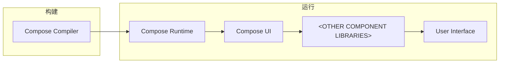
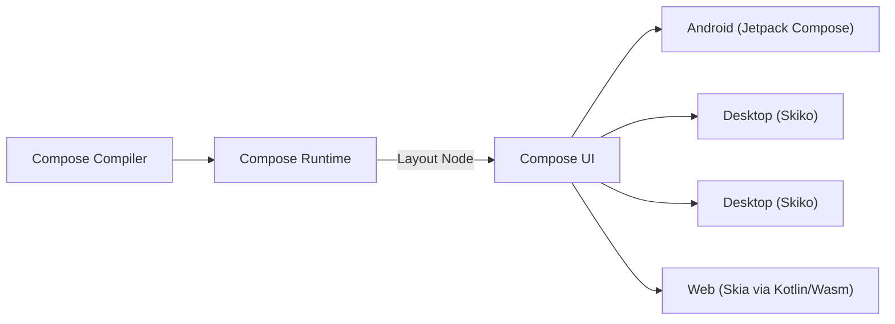

# 将 Compose Multiplatform 移植到 OpenHarmony 的可行性研究

随着鸿蒙系统的宣发，国内有越来越多的行业选择拥抱鸿蒙应用生态。但全新的生态，若从原生迁移构建新的应用，则需要大量的时间、学习、人力等成本。
但好在为了解决这种问题，业内涌现了许多优秀的多平台开发框架，其中不乏有 [Qt](https://qt.io)、[Flutter](https://flutter.dev)、[React Native](https://reactnative.dev) 等等。
鸿蒙的 Flutter 支持似乎是目前最受欢迎的 *~~（以至于官方 ArkUI 代码中都带有 Flutter 字样）~~*，多平台框架的支持既可以减少开发的压力，又可以的在短时间内快速补充鸿蒙的生态。
但我们今天探讨的主角是由 [Jetpack Compose](https://developer.android.com/develop/ui/compose) 演化而来新兴多平台 UI 框架 —— [Compose Multiplatform](https://jetbrains.com/lp/compose-multiplatform)。

<!-- more -->

## Compose 实现多平台的奥秘

> 本文不会深谈 iOS 相关的内容，若有误请不要喷我 qwq *~~（因为我没干过 Apple 的开发）~~*

Compose 的概念最初出现在 Android 上，作为 Jetpack 的一部分发布，叫做 Jetpack Compose。
作为一个现代的 UI 构建框架，得益于 Kotlin 优秀的语言特性，它能够使用更少、更直观的代码构建原生 Android 页面。

那么我们在使用 Jetpack Compose 构建和运行应用的时候到底发生了什么？



=== "Compose Compiler"

    Kotlin 编译器插件。用于静态检查优化和将 `@Composable` 函数转换为 Composition 的生成。

=== "Compose Runtime"

    对 Composition 进行管理（状态表的管理和渲染树的生成）。

=== "Compose UI"

    渲染树管理的实现，再将生成后的渲染树进行布局和绘制。

=== "<OTHER COMPONENT LIBRARIES\>"

    基于 Compose UI 提供库代码和组件等等，例如：

    - Compose Fundation
    - Compose Material
    - [OreCompose](https://github/Cdm2883/OreCompose) <small>~~*夹带私货*~~</small>

从整个过程来看 Compose UI 之前的部分都是平台无关的，驱动着一棵节点树的更新，支持着整个 Compose 的运转。
而 Compose UI 则是与当前平台所关联的，包装不同平台的差异，处理输入，管理真正的渲染树和将生成的渲染树给画出来。
<small>*（是不是很像虚拟 Dom 和真实 Dom 的关系 XD。其实从这里也可以看出 Compose 不止可以用来构建 UI。
还记得在 Compose 诞生之初有人拿 Compose 做了一个测试框架，但具体的仓库好像忘记了 :P）*</small>

JetBrains 团队创建的 Compose Multiplatform 项目则利用这一点，借助 Kotlin 的多平台能力，厚积薄发，为基于 Skia 的 Compose UI 提供各个平台相应的绑定。
由于都用的同一个渲染引擎（Skia）、同一套节点树和流程，这样就实现了多平台统一风格样式组件的 UI，甚至可以借用 Android *(Jetpack Compose)* 那边[已有的](https://github.com/JetBrains/compose-multiplatform-core)通用组件库。



---

Compose 实现多平台还有另一种方式 —— **使用平台原生的页面元素**。  
事实上曾经的 Compose Web *（[现 Compose HTML](https://github.com/JetBrains/compose-multiplatform/commit/59eda00380981b2555cd62d26e8d6f4122a13c40)）*就是这样做的。
<small>*（通过改名也能看出，JetBrains 团队不希望在 Web 上使用 Compose 会与其他平台过于割裂）*</small>
```kotlin title="Written in Compose HTML"
fun main() = renderComposable(rootElementId = "root") { Body() }

@Composable
fun Body() {
    var counter by remember { mutableStateOf(0) }
    Div(attrs = {
        style {  // css style, not modifier
            width(20.percent)
            height(10.percent)
        }
    }) {
        Text("Clicked: ${counter}")
    }
    Button(attrs = {
        style { property("padding", "0px 0px 0px 16px") }
        onClick { _ -> counter++ }
    }) {
        Text("Click")
    }
}
```
从这一段代码很容易看出，这里虽然沿用了 Compose 的状态管理，但是还是采用了浏览器原生 Dom 来构建的 UI。
这样做，由于每个平台的差异性，又无法做到 UI 共用一个代码了。

有什么办法消除这种差异？聪明的你很容易就能想到，可以用抽象的思想！把每个组件抽象化，提取通用部分，再具体在每个平台进行实现。
而 [Redwood](https://github.com/cashapp/redwood) 就是这么做的：

??? example annotate "示例"

    ```kotlin title="Schema (1)" linenums="1"
    @Widget(1)
    data class Button(
        @Property(1)
        val text: String?,
    
        @Property(2)
        @Default("true")
        val enabled: Boolean,
    
        @Property(3)
        val onClick: (() -> Unit)? = null,
    )
    ```

    === "Android"
    
        ```kotlin linenums="1" hl_lines="2"
        internal class AndroidButton(
            override val value: android.widget.Button,
        ) : Button<View> {
            override var modifier: /*app.cash.redwood.*/Modifier = Modifier
            override fun text(text: String?) {
                value.text = text
            }
            override fun enabled(enabled: Boolean) {
                value.isEnabled = enabled
            }
            override fun onClick(onClick: (() -> Unit)?) {
                value.setOnClickListener(onClick?.let { { onClick() } })
            }
        }
        ```
    
    === "Web"
    
        ```kotlin linenums="1" hl_lines="2"
        internal class HtmlButton(
            override val value: HTMLButtonElement,
        ) : Button<HTMLElement> {
            override var modifier: /*app.cash.redwood.*/Modifier = Modifier
            override fun text(text: String?) {
                value.textContent = text
            }
            override fun enabled(enabled: Boolean) {
                value.disabled = !enabled
            }
            override fun onClick(onClick: (() -> Unit)?) {
                value.onclick = onClick?.let { { onClick() } }
            }
        }
        ```
    
    === "Desktop"
    
        ```kotlin linenums="1" hl_lines="8-16"
        internal class ComposeUiButton : Button<@Composable () -> Unit> {
            private var text by mutableStateOf("")
            private var isEnabled by mutableStateOf(false)
            private var onClick by mutableStateOf({})
        
            override var modifier: /*app.cash.redwood.*/Modifier = Modifier
        
            override val value = @Composable {
                androidx.compose.material.Button(
                    onClick = onClick,
                    enabled = isEnabled,
                    modifier = androidx.compose.ui.Modifier.fillMaxWidth(),
                ) {
                    Text(text)
                }
            }
        
            override fun text(text: String?) {
                this.text = text ?: ""
            }
            override fun enabled(enabled: Boolean) {
                this.isEnabled = enabled
            }
            override fun onClick(onClick: (() -> Unit)?) {
                this.onClick = onClick ?: {}
            }
        }
        ```
    
    === "iOS"
    
        ```kotlin linenums="1" hl_lines="5-7"
        // NOTE: This class must be public for the click selector to work.
        class IosButton : Button<UIView> {
            override var modifier: /*app.cash.redwood.*/Modifier = Modifier
            
            override val value = UIButton().apply {
                backgroundColor = UIColor.grayColor
            }
    
            override fun text(text: String?) {
                value.setTitle(text, UIControlStateNormal)
            } 
            override fun enabled(enabled: Boolean) {
                value.enabled = enabled
            }
        
            private val clickedPointer = sel_registerName("clicked")
            @ObjCAction
            fun clicked() {
                onClick?.invoke()
            }
            private var onClick: (() -> Unit)? = null
            override fun onClick(onClick: (() -> Unit)?) {
                this.onClick = onClick
                if (onClick != null) {
                    value.addTarget(this, clickedPointer, UIControlEventTouchUpInside)
                } else {
                    value.removeTarget(this, clickedPointer, UIControlEventTouchUpInside)
                }
            }
        }
        ```

1. Redwood 会自动生成类型安全的 API 供包装。例如这个会生成的接口：
   ```kotlin
   // ...
   interface Button<W : Any> : Widget<W> {
       // ...
       fun text(text: String?)
       fun enabled(enabled: Boolean)
       fun onClick(onClick: (() -> Unit)?)
   }
   // ...
   ```
   <br/>
   完整示例代码详情请看：[samples/counter/schema/src/main/kotlin/com/example/redwood/counter/schema.kt](https://github.com/cashapp/redwood/blob/71fc67243dbc39fc3a6d2b579ef10a07e451e7b8/samples/counter/schema/src/main/kotlin/com/example/redwood/counter/schema.kt)

使用原生组件，理所应当会更贴近原生的体验。但很显然，这样做工作量可不小；由于每个人可能对底层抽象模式有不同的标准，组件库也很难做到通用。

## 将 Compose UI 移植到鸿蒙

截至到这篇博文发布，其实已经有个人，甚至许多大厂在探索自己的解决方案。

基于原生包装方案的，我找到了使用 Redwood 制作的 [compose-ez-ui](https://github.com/Compose-for-OpenHarmony/compose-ez-ui)。
纵然这是一次有趣的尝试，但大家更想要的一定会是兼容现有 Compose Multiplatform 生态的实现。
也就是说，我们需要移植 Compose UI，用 skia canvas 在鸿蒙上进行自绘制。

据未验证消息，上上上个月(1)腾讯在深圳的演讲，透露了他们的团队正在为 OpenHarmony 做 Skia 的 Binding，计划在 2025 年开源。
而且腾讯视频等应用在其鸿蒙版上早已运用了 Kotlin + Compose 的技术，据说美团也有相关的研究。
快手团队也在探索 KMP 在鸿蒙上的可能，现已在快影等应用使用了相关技术……
{ .annotate }

1. 啊啊啊这篇博文托更好几个月了<small>*（因为学业和我太懒）逃）*</small>，这个时间反复改了好几次

Compose UI 的移植相对会简单不少<small>*（很多通用代码和包装）*</small>，
那我们这里就探讨一下对设备 Skia 进行绑定的几个大体方向：

### 使用原生 Skia

但在一切开始之前，我想先提一个在 KotlinConf'24 中由 [Jake Wharton](https://github.com/JakeWharton)(1) 分享的一个有趣的故事……
{ .annotate }

1. Jake Wharton（Cash App Android 工程师）。同时，Redwood 也是 Cash App 的开源项目。

<!--suppress CssUnusedSymbol, SpellCheckingInspection -->
<style>
#composeui-lightswitch-figcaption .md-annotation__index:after {
    margin-left: -.94ch;
}
</style>
<figure style="width: 100%;margin-top: 2em;" class="annotate">
    <!--suppress HtmlUnknownAttribute, HtmlDeprecatedAttribute -->
    <iframe
        style="border-radius: .1rem;aspect-ratio: 16 / 9;"
        src="//player.bilibili.com/player.html?isOutside=true&aid=1956437488&bvid=BV1ky411e7ox&cid=1648024007&p=1"
        width="100%"
        scrolling="no"
        border="0"
        frameborder="no"
        framespacing="0"
        allowfullscreen="allowfullscreen">
    </iframe>
    <figcaption id="composeui-lightswitch-figcaption" style="max-width: none;">在智能电灯开关上运行 Compose UI：探索 Compose 的嵌入式应用(1)</figcaption>
</figure>

1. 一些相关的链接：[Github](https://github.com/JakeWharton/composeui-lightswitch)、
   [BiliBili](https://www.bilibili.com/video/BV1ky411e7ox)、
   [Youtube](https://youtu.be/D0P5Lb-2uCY)、
   [Home Assistant Community](https://community.home-assistant.io/t/500842)。

视频较长，在这里我就简要地总结一下：

讲师的朋友在亚马逊发现了一个存在未加密 ADB 接口的智能开关设备，并且可以轻松地获得 Root 权限。
这引发了讲师的兴趣，促使了他购买该设备并尝试探索在其上使用 Compose 构建出自己的用户界面[^1]。

探索的过程中他发现设备运行的是一个简化的 Linux 系统，而不是安卓。所以他首先尝试在设备上运行 JVM，
并测试了简单的 "Hello World" 程序，证明了设备可以支持 JVM，这让他信心倍增。

但在尝试直接在设备上运行 Compose Desktop (JVM) 时，讲师遇到了诸多挑战。
首先 [Skiko](https://github.com/JetBrains/skiko) 很快发出了不满的声音：
`libGL.so.1: connot open shared object file: No such file or directory`。
这说明设备上的 OpenGL 是 OpenGL ES、不完整或非常规的。
并且 Compose Desktop 使用了 Swing (AWT)，AWT Linux 默认情况下依赖于 X11 等桌面环境，显然这个小小的开关是没有这些东西的。

那该智能开关的原界面是怎样绘制的？
该智能开关的原界面是通过 Flutter 构建的。Flutter 使用 Skia 作为图形引擎，而在当前设备上用的 OpenGL ES 作为后端，并最终通过 DRM 直接输出渲染结果到显示设备。

几经转折，讲师找到了 [Linux_DRM_OpenGLES.c](https://gist.github.com/Miouyouyou/89e9fe56a2c59bce7d4a18a858f389ef)
并成功在设备上运行了，但这些都是 C 代码，而这里是 **Kotlin**Conf，
所以讲师又尝试了 Kotlin/Native 的 Hello World，事实证明这可以编译运行，这使他大致知道了他应该怎么做。

他又花费了几周的时间用 Kotlin/Native 重写了全部逻辑，一切好似又回到了开头，但这次是使用 Kotlin 来构建所需的一切。
是时候让事情变得有趣了！为了在 Kotlin/Native 方便地使用 Skia 同时为后面对接 Compose UI 做准备，还是回到了 Skiko 项目。


[//]: # (这说明 不完整 非常规 OpenGL)
[//]: # (但是 Flutter also based on skia but can run)

[^1]:

    朋友原话：

    btw. new home automation side project:
    I bought [one of these]() and have been trying to get my own app installed on it.
    Super cheap hardware with exactly the design I want,
    but Chinese servers and no Home Assistant support (hence the custom app).

    Someone discovered it has an ADB server running with no password and root access,
    so getting into the device is simple. Turns out though, I don't think it's AOSP.
    It's some stripped down Linux install that happens to have adbd running.

    Been a fun project so far. I might have questions..

### 在 ArkUI 层实现 Skia

占位
