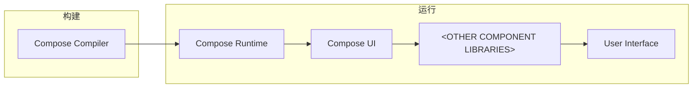

# 将 Compose Multiplatform 移植到 OpenHarmony 的可行性研究

随着鸿蒙系统的宣发，国内有越来越多的行业选择拥抱鸿蒙应用生态。但全新的生态，若从原生迁移构建新的应用，则需要大量的时间、学习、人力等成本。
但好在为了解决这种问题，业内涌现了许多优秀的多平台开发框架，其中不乏有 [Qt](https://qt.io)、[Flutter](https://flutter.dev)、[React Native](https://reactnative.dev) 等等。
鸿蒙的 Flutter 支持似乎是目前最受欢迎的 *~~（以至于官方 ArkUI 代码中都带有 Flutter 字样）~~*，多平台框架的支持既可以减少开发的压力，又可以的在短时间内快速补充鸿蒙的生态。
但我们今天探讨的主角是由 [Jetpack Compose](https://developer.android.com/develop/ui/compose) 演化而来新兴多平台 UI 框架 —— [Compose Multiplatform](https://jetbrains.com/lp/compose-multiplatform)。

<!-- more -->

## Compose 实现多平台的奥秘

> 本文不会提及、谈论 iOS 相关的内容 *~~（因为我没干过 Apple 的开发）~~*

Compose 的概念最初出现在 Android 上，作为 Jetpack 的一部分发布，叫做 Jetpack Compose。
作为一个现代的 UI 构建框架，得益于 Kotlin 优秀的语言特性，它能够使用更少、更直观的代码构建原生 Android 页面。

那么我们在使用 Jetpack Compose 构建和运行应用的时候到底发生了什么？

=== "Compose Compiler"

    Kotlin 编译器插件。用于静态检查优化和将 `@Composable` 函数转换为 Composition 的生成。

=== "Compose Runtime"

    对 Composition 进行管理（状态表的管理和渲染树的生成）。

=== "Compose UI"

    渲染树管理的实现，再将生成后的渲染树进行布局和绘制。

=== "<OTHER COMPONENT LIBRARIES\>"

    基于 Compose UI 提供库代码和组件等等，例如：

    - Compose Fundation
    - Compose Material

从整个过程来看 Compose UI 之前的部分都是平台无关的，驱动着一棵节点树的更新，支持着整个 Compose 的运转。
而 Compose UI 则是与当前平台所关联的，用适合当前平台绘制的方式，管理渲染树和将生成的渲染树给画出来。
*（其实从这里也可以看出 Compose 不止可以用来构建 UI。
还记得在 Compose 诞生之初有人拿 Compose 做了一个测试框架，但具体的仓库好像忘记了 :P）*

Compose Multiplatform 所做的

## 将 Compose UI 移植到鸿蒙

[//]: # (redwood -> native, e.g.: https://github.com/Compose-for-OpenHarmony/compose-ez-ui)
[//]: # (https://github.com/cashapp/redwood)

占位
