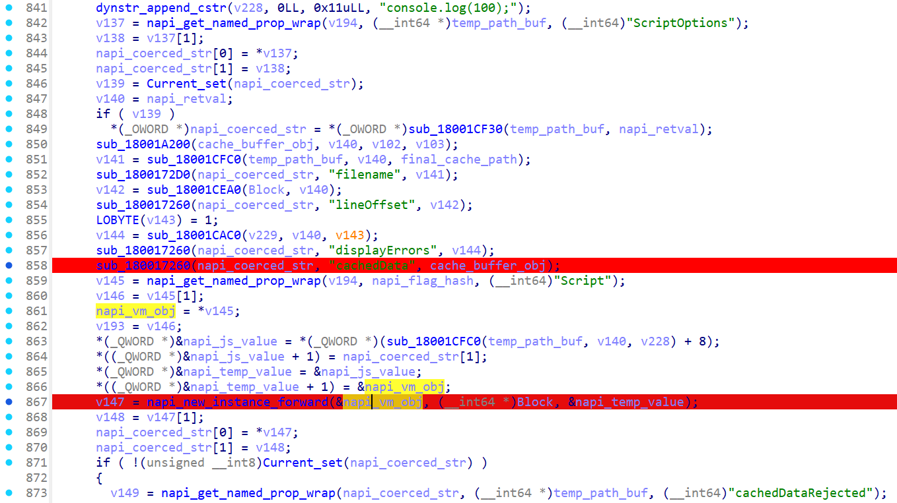

# V8 字节码反汇编实战：分析受保护的 JavaScript 代码

当我们需要发布用于 Node.js 的 JavaScript SDK，或在 Electron、NW.js 等基于 V8 的框架上开发桌面应用时，
往往希望能够保护其核心源代码，避免业务逻辑被轻易窥见。
谈到 JavaScript（以下简称 JS） 的“加密”或保护，通常会想到诸如 [javascript-obfuscator](https://github.com/javascript-obfuscator/javascript-obfuscator)
等这样的混淆工具用以降低代码的可读性，但这些工具的最终产物仍旧是 JS 文件。
对于那些在运行时能够固定 V8 版本的场景（例如打包的 Node.js SDK、Electron 应用等），我们可以采用更底层的方案：**保存 V8 字节码**。
V8 字节码本质上是 Ignition 引擎解释执行的中间表示（IR）缓存，用于加速 JS 的运行；
它随 V8 版本迭代而快速变化，具有明显的 ABI 不稳定性。公开的针对 V8 字节码的反编译工具相对稀少 —— 这似乎让它看起来更安全。
但这真能算是万无一失的保护手段吗？

<!-- more -->

## 分析的开始

!!! warning "免责声明"

    本文所涉及的技术、工具及示例仅用于学习和研究目的，不得将上述内容用于商业或者非法用途，
    否则，一切因不当使用本文信息而造成的任何后果由使用者自行承担！


一切都要从某个国产 IM 软件说起……
近年来，该软件已使用 Electron 重构，再经过一段时间的迭代更新，
来自博客 [V8 字节码反编译 还原 Bytenode 保护的 JS 代码 - 白帽酱](https://rce.moe/2025/01/07/v8-bytecode-decompiler) 的内容已经不再适用。
因此本文将以文章发布时它的最新版本 `9.9.20-37625 (64位)` 作为教具，开始我们的分析。

按照常规的 Electron 分析流程，我们首先定位软件的 `package.json` 来确定其 JS 的入口：

```json title="package.json" hl_lines="6"
{
  // ...
  "version": "9.9.20-37625",
  "private": true,
  // ...
  "main": "./application.asar/app_launcher/index.js",
  "buildVersion": "37625",
  "isPureShell": true,
  "isByteCodeShell": true,
  "platform": "win32",
  "eleArch": "x64"
}
```

可以看到，应用的 JS 源码被打包在 `application.asar` 中。
不过在安装目录中，我们会发现这并不是一个文件夹，而是一个**文件**！

其实这是一种专为 Electron 应用程序设计的类似 `tar` 的存档格式，
也是 Electron 应用常见的开发范式，用于把源码都打包到一起，这样不仅能让文件结构更整洁，还能缓解 Windows 上有关路径长度的问题。  
Electron 也提供了相关的命令行工具 [`@electron/asar`](https://www.npmjs.com/package/@electron/asar)，
能够帮助我们轻松的解压 `asar` 文件，那我们就赶紧来解压试试看吧！

于是我们尝试执行：`#!powershell npx asar extract .\application.asar .\temp`。
一切看似顺利，但当我们查看解压出的文件内容时，却发现全是乱码 —— 很显然，这个文件被加密了！

好在查阅 [Electron 的文档](https://www.electronjs.org/zh/docs/latest/tutorial/asar-archives) 后可以得知，
在程序运行环境中，我们依然可以通过 Node.js 的 `fs` 模块直接读取 asar 内的文件。这就给了我们可操作的空间。

通过简单的编写并注入 (1) 以下代码，我们可以实现真正的“解压”这个文件：
{ .annotate }

1. 关于“如何注入”，请读者自行实现，本文不作讨论。

```js
const { resolve } = require("path");
const fs = require("fs");

const pathApp = `<存档文件的绝对路径>`;
const pathOut = `<保存解压文件的绝对路径>`;  // 不需要尾随 `\` !

import("@electron/asar").then(({ listPackage }) => {
    for (const path of listPackage(pathApp)) {
        const src  = pathApp + path,
              dist = pathOut + path;
        fs.mkdirSync(resolve(dist, '..'), { recursive: true });
        fs.readFile(src, (err, buffer) => {
            if (err) return console.warn(err);
            fs.writeFile(dist, buffer, {}, () => undefined);
        });
    }
});
```

但是事情并没有就此结束，反而刚刚进入正题。解压出的文件非常反常：
<span id="app_launcher_index_js"></span>

```js title="app_launcher/index.js"
require('../../major.node').load('internal_index', module);
```

而且不止这一个文件，其中的大部分文件都是这样类似的结构，
把真正的逻辑委托给一个 `.node` 原生模块来加载。
由此，下一步的目标就十分明确了 —— 继续去分析这个 `major.node` 文件。

## 提取出 V8 字节码

原生模块，也叫 `Addons`，其实载体就是一个动态链接库。
当原生模块被 `require` 时，内部会通过调用 `#!c void napi_module_register(napi_module* mod)`
来往 `#!js module.exports` 上挂内容。

现在我们把 `major.node` 导入 `IDA Pro` 并根据导入表定位到调用这个函数的地方：

```c linenums="1"
__int64 sub_180001000()
{
    return napi_module_register(&dword_18003F000);
}
```

很明显，这个结构体 `dword_18003F000` 就是 `napi_module`。
我们继续从 Node.js 的头文件中获取结构体的详细结构：

```c
typedef napi_value (*napi_addon_register_func)(
    napi_env env,
    napi_value exports
);

typedef struct {
    int                         nm_version;
    unsigned int                nm_flags;
    const char*                 nm_filename;
    napi_addon_register_func    nm_register_func;
    const char*                 nm_modname;
    void*                       nm_priv;
    void*                       reserved[4];
} napi_module;
```

根据定义我们能够轻易地推断出 nm_register_func 的位置：

```c title="sub_180016D70" linenums="1"
__int64 __fastcall Init(__int64 env, __int64 exports)
{
    _QWORD v3[5]; // [rsp+20h] [rbp-28h] BYREF
    __int64 (__fastcall *v4)(); // [rsp+50h] [rbp+8h] BYREF
    __int64 v5; // [rsp+58h] [rbp+10h] BYREF
    __int64 v6; // [rsp+60h] [rbp+18h] BYREF

    v5 = env;
    v4 = Init0;                                   // sub_18001A8E0
    v6 = exports;
    v3[0] = &v4;
    v3[1] = &v5;
    v3[2] = &v6;
    return TryInit((__int64)v3);                  // sub_180017400
}
```

我们继续查看 `TryInit`(`sub_180017400`) 的伪代码：

```c title="sub_180017400" linenums="1" hl_lines="16"
__int64 __fastcall TryInit(__int64 a1)
{
    __int64 (*v1)(void); // r9
    const Napi::Error **v2; // rax
    const Napi::Error *v3; // r8
    __int64 result; // rax
    const Napi::Error *v5[4]; // [rsp+20h] [rbp-38h] BYREF

    v1 = **(__int64 (***)(void))a1;               // Init0
    v2 = *(const Napi::Error ***)(a1 + 16);       // exports
    v3 = *v2;
    v5[2] = **(const Napi::Error ***)(a1 + 8);    // env
    v5[3] = v3;
    try
    {
        result = *(_QWORD *)(v1() + 8);
    }
    catch ( const Napi::Error *v5 )
    {
        ThrowNapiErrorIfExists((__int64)v5[0]);
        return 0LL;
    }
    result = *(_QWORD *)(v1() + 8);
}
```

结合来自 `Init` 的入参 `v3[0]`，可以得知这里调用的 `v1` 就是 `Init0`。

```c title="sub_18001A8E0" linenums="1" hl_lines="13 35"
_OWORD *__fastcall Init0(_OWORD *a1, __int64 a2, __int64 *a3)
{
  char *v6; // rax
  int v7; // ecx
  char v8; // al
  _QWORD *v9; // rdi
  __int64 v10; // rbx
  _OWORD *result; // rax
  __int64 load_func_value; // [rsp+30h] [rbp-88h] BYREF
  __int64 load_str_value; // [rsp+38h] [rbp-80h] BYREF
  _BYTE pExceptionObject[80]; // [rsp+40h] [rbp-78h] BYREF

  v6 = getenv("??V8BytecodeDebug");             // 已去除部分敏感信息
  if ( v6 )
  {
    v7 = (unsigned __int8)*v6 - 49;
    if ( *v6 == 49 )                            // '1'
      v7 = (unsigned __int8)v6[1];
    v8 = is_v8_bytecode_debug;                  // byte_184C8F0C0
    if ( !v7 )
      v8 = 1;
    is_v8_bytecode_debug = v8;
  }
  v9 = operator new(0x10u);
  if ( v9 )
  {
    v9[1] = 0;
    *v9 = func_exports_load_data;               // sub_18001AAD0
  }
  else
  {
    v9 = 0;
  }
  // sub_18001D5A0 == func_exports_load
  if ( (unsigned int)napi_create_function(a2, 0, -1, func_exports_load, v9, &load_func_value)
    || (unsigned int)napi_add_finalizer(a2, load_func_value, v9, &sub_180016DB0, 0, 0) )
  {
    j_j_free(v9);
    CreateNapiError((__int64)pExceptionObject, a2);
    throw (Napi::Error *)pExceptionObject;
  }
  if ( (unsigned int)napi_create_string_utf8(a2, "load", 4, &load_str_value) )
  {
    CreateNapiError((__int64)pExceptionObject, a2);
    throw (Napi::Error *)pExceptionObject;
  }
  v10 = *a3;
  if ( (unsigned int)napi_set_property(*a3, a3[1], load_str_value, load_func_value) )
  {
    CreateNapiError((__int64)pExceptionObject, v10);
    throw (Napi::Error *)pExceptionObject;
  }
  result = a1;
  *a1 = *(_OWORD *)a3;
  return result;
}
```

从这里开始有些初见端倪了，能够注意到这里有一个判断环境变量 `??V8BytecodeDebug` 是否为 `1`
并以此开关全局变量 `is_v8_bytecode_debug`。这表明这个加载似乎与 V8 字节码有关？  
现在，我们给系统增加一条环境变量 `??V8BytecodeDebug=1`，这个 debug 开关或许以后有用？

好了，还记得之前的 [`app_launcher/index.js`](#app_launcher_index_js) 文件吗？
现在我们终于找到了调用 `load` 函数时，在 native 层真正会被调用的函数 `func_exports_load`，了吗？

```c title="sub_18001D5A0"
__int64 __fastcall func_exports_load(__int64 env, __int64 info)
{
  __int64 *v3[3]; // [rsp+20h] [rbp-18h] BYREF
  __int64 v4; // [rsp+40h] [rbp+8h] BYREF
  __int64 v5; // [rsp+48h] [rbp+10h] BYREF

  v5 = info;
  v4 = env;
  v3[0] = &v4;
  v3[1] = &v5;
  return func_exports_load0(v3);                // sub_180017440
}
```

```c title="sub_180017440"
__int64 __fastcall func_exports_load0(__int64 **a1)
{
  __int64 info; // rbx
  __int64 env; // rdi
  int cb_info; // eax
  void (__fastcall **v4)(_BYTE *, unsigned __int64 *); // rcx
  // ...
  unsigned __int64 v6; // [rsp+30h] [rbp-148h] BYREF
  // ...
  __int64 v9; // [rsp+48h] [rbp-130h] BYREF
  unsigned __int64 argc; // [rsp+50h] [rbp-128h] BYREF
  _BYTE *v11; // [rsp+58h] [rbp-120h]
  _BYTE argv[48]; // [rsp+60h] [rbp-118h] BYREF
  void *Block[2]; // [rsp+90h] [rbp-E8h] BYREF
  // ...
  _BYTE v15[8]; // [rsp+A8h] [rbp-D0h] BYREF
  // ...

  info = *a1[1];
  env = **a1;
  v6 = 6LL;
  // ...
  v9 = 0LL;
  *(_OWORD *)Block = 0LL;
  argc = 6LL;
  v11 = argv;
  cb_info = napi_get_cb_info(env, info, &argc, argv, &v9, &Block[1]);
  // ...
  v4 = (void (__fastcall **)(_BYTE *, unsigned __int64 *))Block[1];
  Block[1] = *((void **)Block[1] + 1);
  (*v4)(v15, &v6);                            // func_exports_load_data(v15, &v6);
  // ...
}
```

兜兜转转，我们终于找到了真正的加载逻辑所在的地方：`func_exports_load_data`。  
由于生成出的伪代码太过长了，足足有 `1109` 行！故这里不会完整贴出。



观察这部分伪代码，如果你写过相关的逻辑，应该能够敏锐地察觉到，这是在加载并运行 V8 的字节码！
我们猜测，这些行为可能与以下 JS 代码的行为类似：

```js
const vm = require("vm");

const script = new vm.Script('<DUMMY_CODE>' , {
    filename: '...',
    lineOffset: 0,
    cachedData: <...>,
});

if (script.cachedDataRejected) {
    // ...
}

// script.runInContext();
```

其中 `cachedData` 就是我们进行下一步的关键数据 —— **V8 字节码**！

现在我们只需要动手验证一下想法。根据所猜想的加载方式，
很容易想到可以劫持 `vm.Script` 的构造函数来动态地 dump 出所需的字节码。  
接下来我们在 ^^合适的时机^^ 在主进程注入以下 JS 代码：

```js
const vm = require("vm");

const resourcesPath = process.resourcesPath;  // <安装路径>\versions\9.9.20-37625\resources
const dist = resolve(__dirname, 'dist');

/** @param {vm.ScriptOptions} options */
function dump(options) {
    const filename = relative(resourcesPath, options.filename)
        .replace('application.asar', 'application_asar');
    const path = resolve(dist, filename + '.bin');
    fs.mkdirSync(resolve(path, '..'), { recursive: true });

    const cachedData = options.cachedData;
    fs.writeFile(path, cachedData, {}, () => undefined);

    console.log('dumper', options.filename, cachedData);
}

vm.Script = new Proxy(vm.Script, {
    construct(target, argumentsList, newTarget) {
        // v8.setFlagsFromString("--print-bytecode");
        const instance = Reflect.construct(target, argumentsList, newTarget);
        const options = argumentsList[1];
        if (options) dump(options);
        return instance;
    }
});
```

值得一提的是，该软件在渲染进程也会以同样的方式加载字节码，如：
```js title="application.asar/preload.js"
try{ const { contextBridge } = require('electron');
contextBridge.exposeInMainWorld('electron',{load: (file) => { require('../major.node').load(file, module);}});
}catch{}
require('../major.node').load('p_preload', module);
```

所以我们在 preload 加载前也需要这样注入这样类似的 JS 代码：

```js
vm.Script = new Proxy(vm.Script, { /* ... */ });
```

!!! tip

    若需让 preload 注入和主进程注入保持一样的写法，并将字节码用 `fs` 保存到本地，  
    你需要设法修改 `#!js new BrowserWindow(options)` 的参数 `#!js options.webPreferences.sandbox = false`。
    即关闭有关窗口渲染进程的沙箱环境。

---

WIP

## 反汇编 V8 字节码

WIP
