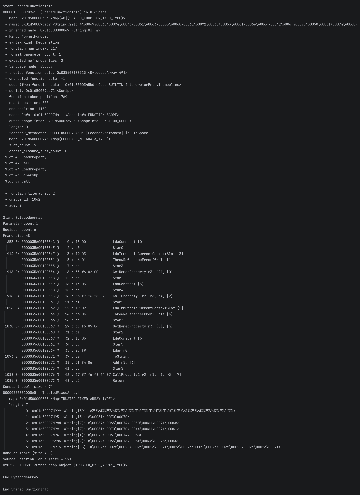

# V8 字节码反汇编实战：分析受保护的 JavaScript 代码

当我们需要发布用于 Node.js 的 JavaScript SDK，或在 Electron、NW.js 等基于 V8 的框架上开发桌面应用时，
往往希望能够保护其核心源代码，避免业务逻辑能够被轻易窥见。
谈到 JavaScript（以下简称 JS） 的“加密”或保护，通常会想到诸如 [javascript-obfuscator](https://github.com/javascript-obfuscator/javascript-obfuscator)
等这样的混淆工具用以降低代码的可读性，但这些工具的最终产物仍旧是 JS 文件。
对于那些在运行时能够固定 V8 版本的场景（例如打包的 Node.js SDK、Electron 应用等），我们可以采用更底层的方案：**保存 V8 字节码**。
V8 字节码本质上是 Ignition 引擎解释执行的中间表示（IR）缓存，用于加速 JS 的运行；
它随 V8 版本迭代而快速变化，具有明显的 ABI 不稳定性。公开的针对 V8 字节码的反编译工具相对稀少 —— 这似乎让它看起来更安全。
但这真能算是万无一失的保护手段吗？

<!-- more -->

## 分析的开始 {#beginning}

!!! warning "免责声明"

    本文所涉及的技术、工具及示例仅用于学习和研究目的，不得将上述内容用于商业或者非法用途，
    否则，一切因不当使用本文信息而造成的任何后果由使用者自行承担！


一切都要从某个国产 IM 软件说起……
近年来，该软件已使用 Electron 重构，再经过一段时间的迭代更新，
来自博客 [V8 字节码反编译 还原 Bytenode 保护的 JS 代码 - 白帽酱](https://rce.moe/2025/01/07/v8-bytecode-decompiler) 的内容已经不再适用。
因此本文将以文章发布时它的最新版本 `9.9.31-49738 (64位)` 作为教具，开始我们的分析。

按照常规的 Electron 分析流程，我们首先定位软件的 `package.json` 来确定其 JS 的入口：

```json title="package.json" hl_lines="6"
{
  // ...
  "version": "9.9.31-49738",
  "private": true,
  // ...
  "main": "./application.asar/app_launcher/index.js",
  "buildVersion": "49738",
  "isPureShell": true,
  "isByteCodeShell": true,
  "platform": "win32",
  "eleArch": "x64"
}
```

可以看到，应用的 JS 源码被打包在 `application.asar` 中。
不过在安装目录中，我们会发现这并不是一个文件夹，而是一个**文件**！

其实这是一种专为 Electron 应用程序设计的类似 `tar` 的存档格式，
也是 Electron 应用常见的开发范式，用于把源码都打包到一起，这样不仅能让文件结构更整洁，还能缓解 Windows 上有关路径长度的问题。  
Electron 也提供了相关的命令行工具 [`@electron/asar`](https://www.npmjs.com/package/@electron/asar)，
能够帮助我们轻松的解压 `asar` 文件，那我们就赶紧来解压试试看吧！

于是我们尝试执行：`#!powershell npx asar extract .\application.asar .\temp`。
一切看似顺利，但当我们查看解压出的文件内容时，却发现全是乱码 —— 很显然，这个文件以某种方式被**加密**了！

好在查阅 [Electron 的文档](https://www.electronjs.org/zh/docs/latest/tutorial/asar-archives) 后可以得知，
在程序运行环境中，我们依然可以通过 Node.js 的 `fs` 模块直接读取 asar 内的文件。这就给了我们可操作的空间。

通过简单的编写并注入 (1) 以下代码，我们可以实现真正的“解压”这个文件：
{ .annotate }

1. 关于“如何注入”，请读者自行实现，本文不作讨论。

```js
const { resolve } = require("path");
const fs = require("fs");

const pathApp = `<存档文件的绝对路径>`;
const pathOut = `<保存解压文件的绝对路径>`;  // 不需要尾随 `\` !

import("@electron/asar").then(({ listPackage }) => {
    for (const path of listPackage(pathApp)) {
        const src  = pathApp + path,
              dist = pathOut + path;
        fs.mkdirSync(resolve(dist, '..'), { recursive: true });
        fs.readFile(src, (err, buffer) => err
          ? console.warn(err)
          : fs.writeFile(dist, buffer, {}, () => undefined));
    }
});
```

但是事情并没有就此结束，反而才刚刚进入正题。我们发现解压出的文件非常反常：

```js {#app_launcher_index_js title="app_launcher/index.js"}
require('../../major.node').load('internal_index', module);
```

而且不止这一个文件，其中的大部分文件都是这样类似的结构，
把真正的逻辑委托给一个相同的模块来加载。
由此，下一步的目标就十分明确了 —— 继续去分析这个 `major.node` 文件。

## 提取出 V8 字节码 {#dumping}

从文件名来看，它并非普通的 JS 模块。扩展名 `.node` 通常意味着这是一个 [Node.js 原生模块](https://nodejs.org/api/addons.html)，
而原生模块（a.k.a. `Addons`）的载体其实就是一个普通的**动态链接库**。

当原生模块被 `#!js require()` 时，内部会调用 `#!c void napi_module_register(napi_module* mod)`
来将内容挂载到 `#!js module.exports`。

现在我们把 `major.node` 导入 `IDA Pro` 并根据导入表定位到调用这个函数的地方：

```c linenums="1"
__int64 sub_180001000()
{
    return napi_module_register(&unk_180054000);
}
```

很明显，这个结构体 `unk_180054000` 就是 `napi_module`。
我们继续从 Node.js 的头文件中获取结构体的详细结构：

```c
typedef napi_value (*napi_addon_register_func)(
    napi_env env,
    napi_value exports
);

typedef struct {
    int                         nm_version;
    unsigned int                nm_flags;
    const char*                 nm_filename;
    napi_addon_register_func    nm_register_func;
    const char*                 nm_modname;
    void*                       nm_priv;
    void*                       reserved[4];
} napi_module;
```

根据定义我们能够轻易地推断出 nm_register_func 的位置：

```c title="sub_180020700" linenums="1"
__int64 __fastcall Init(__int64 env, __int64 exports)
{
    _QWORD v3[5]; // [rsp+20h] [rbp-28h] BYREF
    __int64 (__fastcall *v4)(); // [rsp+50h] [rbp+8h] BYREF
    __int64 v5; // [rsp+58h] [rbp+10h] BYREF
    __int64 v6; // [rsp+60h] [rbp+18h] BYREF

    v5 = env;
    v4 = Init0;                                   // sub_180024270
    v6 = exports;
    v3[0] = &v4;
    v3[1] = &v5;
    v3[2] = &v6;
    return TryInit((__int64)v3);                  // sub_180020D90
}
```

我们继续查看 `TryInit`(`sub_180020D90`) 的伪代码：

```c title="sub_180020D90" linenums="1" hl_lines="16"
__int64 __fastcall TryInit(__int64 a1)
{
    __int64 (*v1)(void); // r9
    const Napi::Error **v2; // rax
    const Napi::Error *v3; // r8
    __int64 result; // rax
    const Napi::Error *v5[4]; // [rsp+20h] [rbp-38h] BYREF

    v1 = **(__int64 (***)(void))a1;               // Init0
    v2 = *(const Napi::Error ***)(a1 + 16);       // exports
    v3 = *v2;
    v5[2] = **(const Napi::Error ***)(a1 + 8);    // env
    v5[3] = v3;
    try
    {
        result = *(_QWORD *)(v1() + 8);
    }
    catch ( const Napi::Error *v5 )
    {
        ThrowNapiErrorIfExists((__int64)v5[0]);
        return 0LL;
    }
    result = *(_QWORD *)(v1() + 8);
}
```

结合来自 `Init` 的入参 `v3[0]`，可以得知这里调用的 `v1` 就是 `Init0`。

```c title="sub_180024270" linenums="1" hl_lines="13 35"
_OWORD *__fastcall Init0(_OWORD *a1, __int64 a2, __int64 *a3)
{
  char *v6; // rax
  int v7; // ecx
  char v8; // al
  _QWORD *v9; // rdi
  __int64 v10; // rbx
  _OWORD *result; // rax
  __int64 load_func_value; // [rsp+30h] [rbp-88h] BYREF
  __int64 load_str_value; // [rsp+38h] [rbp-80h] BYREF
  _BYTE pExceptionObject[80]; // [rsp+40h] [rbp-78h] BYREF

  v6 = getenv("??V8BytecodeDebug");             // 已去除部分敏感信息
  if ( v6 )
  {
    v7 = (unsigned __int8)*v6 - 49;
    if ( *v6 == 49 )                            // '1'
      v7 = (unsigned __int8)v6[1];
    v8 = is_v8_bytecode_debug;                  // byte_1863B7C20
    if ( !v7 )
      v8 = 1;
    is_v8_bytecode_debug = v8;
  }
  v9 = operator new(0x10u);
  if ( v9 )
  {
    v9[1] = 0;
    *v9 = func_exports_load_data;               // sub_180024460
  }
  else
  {
    v9 = 0;
  }
  // sub_180026F30 == func_exports_load
  if ( (unsigned int)napi_create_function(a2, 0, -1, func_exports_load, v9, &load_func_value)
    || (unsigned int)napi_add_finalizer(a2, load_func_value, v9, &sub_180020740, 0, 0) )
  {
    j_j_free(v9);
    CreateNapiError((__int64)pExceptionObject, a2);
    throw (Napi::Error *)pExceptionObject;
  }
  if ( (unsigned int)napi_create_string_utf8(a2, "load", 4, &load_str_value) )
  {
    CreateNapiError((__int64)pExceptionObject, a2);
    throw (Napi::Error *)pExceptionObject;
  }
  v10 = *a3;
  if ( (unsigned int)napi_set_property(*a3, a3[1], load_str_value, load_func_value) )
  {
    CreateNapiError((__int64)pExceptionObject, v10);
    throw (Napi::Error *)pExceptionObject;
  }
  result = a1;
  *a1 = *(_OWORD *)a3;
  return result;
}
```

从这里开始便有些初见端倪了。能够注意到这里有一个判断环境变量 `??V8BytecodeDebug` 是否为 `1`，
并以此开关全局变量 `is_v8_bytecode_debug` 的语句。  
我们给系统增加一条环境变量 `??V8BytecodeDebug=1`，或许这个 debug 开关以后留着有用。
{ #is_v8_bytecode_debug }

还记得之前的 [`app_launcher/index.js`](#app_launcher_index_js) 文件吗？
现在我们终于找到了调用 `load` 函数时，在 native 层真正会被调用的函数 `func_exports_load`... 了吗？
我们继续深入：

```c title="sub_180026F30"
__int64 __fastcall func_exports_load(__int64 env, __int64 info)
{
  __int64 *v3[3]; // [rsp+20h] [rbp-18h] BYREF
  __int64 v4; // [rsp+40h] [rbp+8h] BYREF
  __int64 v5; // [rsp+48h] [rbp+10h] BYREF

  v5 = info;
  v4 = env;
  v3[0] = &v4;
  v3[1] = &v5;
  return func_exports_load0(v3);                // sub_180020DD0
}
```

```c title="sub_180020DD0"
__int64 __fastcall func_exports_load0(__int64 **a1)
{
  __int64 info; // rbx
  __int64 env; // rdi
  int cb_info; // eax
  void (__fastcall **v4)(_BYTE *, unsigned __int64 *); // rcx
  // ...
  unsigned __int64 v6; // [rsp+30h] [rbp-148h] BYREF
  // ...
  __int64 v9; // [rsp+48h] [rbp-130h] BYREF
  unsigned __int64 argc; // [rsp+50h] [rbp-128h] BYREF
  _BYTE *v11; // [rsp+58h] [rbp-120h]
  _BYTE argv[48]; // [rsp+60h] [rbp-118h] BYREF
  void *Block[2]; // [rsp+90h] [rbp-E8h] BYREF
  // ...
  _BYTE v15[8]; // [rsp+A8h] [rbp-D0h] BYREF
  // ...

  info = *a1[1];
  env = **a1;
  v6 = 6LL;
  // ...
  v9 = 0LL;
  *(_OWORD *)Block = 0LL;
  argc = 6LL;
  v11 = argv;
  cb_info = napi_get_cb_info(env, info, &argc, argv, &v9, &Block[1]);
  // ...
  v4 = (void (__fastcall **)(_BYTE *, unsigned __int64 *))Block[1];
  Block[1] = *((void **)Block[1] + 1);
  (*v4)(v15, &v6);                            // func_exports_load_data(v15, &v6);
  // ...
}
```

兜兜转转，我们终于找到了真正的加载逻辑所在的地方：`func_exports_load_data`。  
由于生成出的伪代码太过长了，足足有 `1109` 行！故这里不会完整贴出。


观察这部分伪代码，如果你翻阅过 Bytenode 的仓库，应该能够敏锐地察觉到，这是就在加载并运行 V8 的字节码！
我们可以合理猜测，这段 napi 调用可能与以下 JS 代码的行为类似：

```js
const vm = require("vm");

const DUMMY_CODE = 'console.log(100);';
const script = new vm.Script(DUMMY_CODE, {
    filename: '...',
    lineOffset: 0,
    cachedData: <...>,
});

if (script.cachedDataRejected) {
    // ...
}

// script.runInContext();
```

其中 `cachedData` 就是我们进行下一步的关键数据 —— **V8 字节码**！

现在我们只需要动手验证一下想法。根据所猜想的加载方式，
能很容易想到可以劫持 `vm.Script` 的构造函数来动态地 dump 出所需的字节码。  
接下来我们在 ^^合适的时机^^ 在主进程注入以下 JS 代码：

```js
const vm = require("vm");

const resourcesPath = process.resourcesPath;  // <安装路径>\versions\9.9.31-49738\resources
const dist = resolve(__dirname, 'dist');

/** @param {vm.ScriptOptions} options */
function dump(options) {
    const filename = relative(resourcesPath, options.filename)
        .replace('application.asar', 'application_asar');
    const path = resolve(dist, filename + '.bin');
    fs.mkdirSync(resolve(path, '..'), { recursive: true });

    const cachedData = options.cachedData;
    fs.writeFile(path, cachedData, {}, () => undefined);

    console.log('dumper', options.filename, cachedData);
}

vm.Script = new Proxy(vm.Script, {
    construct(target, argumentsList, newTarget) {
        // v8.setFlagsFromString("--print-bytecode");
        const instance = Reflect.construct(target, argumentsList, newTarget);
        const options = argumentsList[1];
        if (options) dump(options);
        return instance;
    }
});
```

值得一提的是，该软件在渲染进程也会以同样的方式加载字节码，如：
```js title="application.asar/preload.js"
try{ const { contextBridge } = require('electron');
contextBridge.exposeInMainWorld('electron',{load: (file) => { require('../major.node').load(file, module);}});
}catch{}
require('../major.node').load('p_preload', module);
```

所以我们在 preload 加载前也需要这样注入这样类似的 JS 代码：

```js
vm.Script = new Proxy(vm.Script, { /* ... */ });
```

!!! tip

    若需让 preload 注入和主进程注入保持一样的写法，并将字节码用 `fs` 保存到本地，  
    你需要设法修改 `#!js new BrowserWindow(options)` 的参数 `#!js options.webPreferences.sandbox = false`。
    即关闭有关窗口渲染进程的沙箱环境。  
    当然，有时关闭沙箱环境会破坏应用（如该教具）的运行，此时可以使用 IPC 进行文件的写入。

---

现在，我们运行程序并查看它的标准输出（仅展示部分内容）：

```eiffel hl_lines="5-8"
[01:18:24.644 INF] [preload] succeeded. <PATH_APP>\versions\9.9.31-49738\resources\app\major.node
[01:18:24.690 INF] [preload] succeeded. <PATH_APP>\versions\9.9.31-49738\resources\app\wrapper.node
[01:18:24.747 INF] resourcesPath: <PATH_APP>\versions\9.9.31-49738\resources
[01:18:24.813 INF] [preload] register done. major.node
[01:18:24.817 INF] major ... v8.31.11
[01:18:24.817 INF] file path: <PATH_APP>\versions\9.9.31-49738\resources\app\app_launcher\
load internal done, file_name: <PATH_APP>\versions\9.9.31-49738\resources\app\app_launcher\index.js
[01:18:26.454 INF] dumper main <PATH_APP>\versions\9.9.31-49738\resources\app\app_launcher\index.js <Buffer 7a 05 de c0 03 58 f2 72 d0 0b 00 00 09 f3 4c 5e 7b e3 bf 40 28 0d 00 00 00 00 00 00 00 00 00 00 01 30 54 1d 03 30 07 b4 1e 60 0c 00 00 00 01 08 07 d9 ... 3350 more bytes>
[01:18:26.457 INF] major ... v8.31.11
[01:18:26.457 INF] file path: <PATH_APP>\versions\9.9.31-49738\resources\app\app_launcher\
load internal done, file_name: <PATH_APP>\versions\9.9.31-49738\resources\app\app_launcher\launcher.js
[01:18:26.459 INF] dumper main <PATH_APP>\versions\9.9.31-49738\resources\app\app_launcher\launcher.js <Buffer 7a 05 de c0 03 58 f2 72 74 ac 00 00 09 f3 4c 5e 7b e3 bf 40 30 ce 00 00 00 00 00 00 00 00 00 00 01 30 54 1d 03 30 07 b4 1e 60 0c 00 00 00 01 08 07 d9 ... 52766 more bytes>
[01:18:26.531 INF] major ... v8.31.11
[01:18:26.531 INF] file path: <PATH_APP>\versions\9.9.31-49738\resources\app\application.asar\
load internal done, file_name: <PATH_APP>\versions\9.9.31-49738\resources\app\application.asar\background.js
[01:18:26.533 INF] dumper main <PATH_APP>\versions\9.9.31-49738\resources\app\application.asar\background.js <Buffer 7a 05 de c0 03 58 f2 72 ed 35 00 00 09 f3 4c 5e 7b e3 bf 40 60 db 00 00 00 00 00 00 00 00 00 00 01 30 54 1d 03 30 07 b4 1e 60 0c 00 00 00 01 08 07 d9 ... 56142 more bytes>
# ...
[01:18:27.406 INF] dumper preload <PATH_APP>\versions\9.9.31-49738\resources\app\application.asar\renderer\polyfill.js Uint8Array(9152) [ ... 9152 more items ]
[01:18:27.407 INF] dumper preload <PATH_APP>\versions\9.9.31-49738\resources\app\application.asar\renderer\commonNodeModule-axios.js Uint8Array(56776) [ ... 56776 more items ]
# ...
[01:18:27.411 INF] dumper preload <PATH_APP>\versions\9.9.31-49738\resources\app\application.asar\renderer\52398.js Uint8Array(53200) [ ... 53200 more items ]
[01:18:27.411 INF] dumper preload <PATH_APP>\versions\9.9.31-49738\resources\app\application.asar\renderer\63661.js Uint8Array(20800) [ ... 20800 more items ]
[01:18:27.411 INF] dumper preload <PATH_APP>\versions\9.9.31-49738\resources\app\application.asar\renderer\85891.js Uint8Array(11424) [ ... 11424 more items ]
[01:18:27.412 INF] dumper preload <PATH_APP>\versions\9.9.31-49738\resources\app\application.asar\renderer\16895.js Uint8Array(79696) [ ... 79696 more items ]
```

哇，我们注入的 dumper 被成功触发了！观察到 dump 出的 Buffer 开头的 `?? ?? DE C0 ?? ?? ?? ??` 了吗，这正是 V8 字节码的魔数部分。
其中 `DE C0` 以外的部分是 V8 引擎内部依据版本号生成的哈希值，能够用于佐证字节码是否能够正常被引擎解析。

继续观察输出，还能发现里面多出了许多额外的调试信息，正是我们[之前设置的环境变量](#is_v8_bytecode_debug)发挥了作用！这能够辅助我们判断执行的过程。

但是徒有字节码我们碳基生物还是无法轻松阅读和分析，所以接下来要着手开始反汇编字节码……

## 反汇编 V8 字节码 {#disassembling}

V8 的 `cachedData` 可不是什么公开的稳定格式，直接手搓二进制解析器的成本显然过于高昂了。
好在，解铃还须系铃人 —— **V8 其实自己就实现了字节码缓存的反序列化！**其核心的入口就是文件 
[src/snapshot/code-serializer.cc](https://github.com/v8/v8/blob/13.8.258.18/src/snapshot/code-serializer.cc#L481)
的 `#!cpp v8::internal::CodeSerializer::Deserialize` 函数。

那我们该如何利用呢？在本文[开头](#beginning)引用的那篇博客和一些相关项目中（如：[noelex/v8dasm](https://github.com/noelex/v8dasm) 和 [j4k0xb/View8](https://github.com/j4k0xb/View8)）就有提及该如何修改 V8 来将反序列化结果打印到标准输出。

至于该如何调用这个函数来启动这一过程，这里我选择了 D8，而不是像上述项目一样静态链接整个 V8 然后用外部程序调用 V8。  
而原因：其一是在 Windows 上要去链接这些库，需要在项目配置中花上不少的心思；其二这也会给我们带来许多*隐形的好处*，我将在后文中详细描述。

!!! note "什么是 D8？"

    > "d8 is useful for running some JavaScript locally or debugging changes you have made to V8."  
    > —— [Using `d8` · V8 Documentation](https://v8.dev/docs/d8)
    
    D8（Developer Shell）是 V8 项目自带的一个 REPL 工具，一个只有 V8 的纯净 JavaScript 解释器。  
    正如文档所说，我们可以使用 D8 来验证一些我们自己对 V8 做出的修改，这非常贴合我们的需求。

事不宜迟，我们赶快开始动手吧！

### 配置 V8 构建环境 {#build-v8}

> ~~由于我手里只有一台 Windows 笔电，硬盘空间什么的又非常紧张，所以最开始我其实打算把构建那些操作全都放在 GitHub Actions 中完成，而我只需要 push 代码到仓库就好了。  
> 但事实证明我错了，在 CI 上以默认配置构建一次 V8 需要整整两个半小时！而且 patch V8 的过程远没有我想象中的那么顺利，这导致每一次测试我都要艰难地等待好长一段时间...  
> 所以说，还是在本地配置一下构建环境比较好，本文托了那么长一段时间才写好也有这部分原因在的呜呜呜呜呜呜~~

构建前我们还需要确认一下 V8 的具体版本，这个倒很简单，我们只需要再次注入 JS `#!js console.log(process.versions)` 然后再运行看看输出就好了：

```js
{ ... v8: '13.8.258.18-electron.0', ... }  // 不用管这个 `-electron.0`，直接用开头的版本 pull 就好了
```

接下来在 Windows 上配置构建环境稍微要比在 Linux 上要麻烦一些，为此我写了几个脚本：

- [scripts/fetch.ps1 · QwQNT/d8-disassembler](https://github.com/QwQNT/d8-disassembler/blob/main/scripts/fetch.ps1)
- [scripts/build.ps1 · QwQNT/d8-disassembler](https://github.com/QwQNT/d8-disassembler/blob/main/scripts/build.ps1)

具体怎么操作读者只需看看脚本内容就能一目了然，这些琐事不是本文主要想讨论的内容。  
运行脚本之前，你还需要确保电脑安装了这些东西：

- Git（这个你总不能没有吧）
- Python 3
- Ninja（~~你甚至可以直接使用 CLion 附带安装的 `bin\ninja\win\x64\ninja.exe`~~）
- Windows 10 SDK（需要搜索并打开相应的 Windows Software Development Kit 应用 → Change → 勾选 Debugging Tools for Windows）

### 实现 V8 反汇编器 {#patch-v8}

然后我们开始修改代码。先给 D8 暴露一个 `loadBytecode()` 函数，传入一个 `cachedData` 文件路径，作为我们整个反汇编流程的入口：

```cpp title="src/d8/d8.h" hl_lines="3"
class Shell : public i::AllStatic {
 public:
  static void LoadBytecode(const v8::FunctionCallbackInfo<v8::Value>& info);
```

```cpp title="src/d8/d8.cc" hl_lines="3-4"
Local<ObjectTemplate> Shell::CreateGlobalTemplate(Isolate* isolate) {
  // ...
  global_template->Set(isolate, "loadBytecode",
                       FunctionTemplate::New(isolate, LoadBytecode));
  return global_template;
}
```

```cpp
void Shell::LoadBytecode(const v8::FunctionCallbackInfo<v8::Value>& info) {
  auto isolate = info.GetIsolate();
  auto isolateInternal = reinterpret_cast<v8::internal::Isolate*>(isolate);

  v8::String::Utf8Value filename(isolate, info[0]);
  int length = 0;
  std::unique_ptr<char[]> raw_filedata(ReadChars(*filename, &length));
  auto filedata = reinterpret_cast<uint8_t*>(raw_filedata.get());

  v8::internal::AlignedCachedData cached_data(filedata, length);
  auto source = isolateInternal->factory()
                    ->NewStringFromUtf8(base::CStrVector("source"))
                    .ToHandleChecked();
  v8::internal::ScriptDetails script_details;

  printf("===== START DESERIALIZE BYTECODE =====\n");
  v8::internal::CodeSerializer::Deserialize(isolateInternal, &cached_data,
                                            source, script_details);
}
```

值得一提的是，我并没有使用 V8 的 public API
[`ScriptCompiler::CompileUnboundScript()`](https://github.com/v8/v8/blob/13.8.258.18/src/api/api.cc#L2397)
来间接调用 `#!cpp Deserialize()`。
原因之一，是随着 V8 版本的更新，这个方法的签名已然发生了改变，那些文章的写法已经不再适用了；
其二，我们的代码在 D8 中编写，可以直接调用 `internal` 方法而不是欺骗公开 API 去走那堆无用的流程。

然后我们仿造(1)刚刚提及的那些资料修改 V8，使它能在反序列化时吐出我们想要的信息：
{ .annotate }

1. 他们的 V8 版本实在是太老了！这里均改成了新版 V8 的写法

<span style="display: block; margin-top: -.6rem;"></span>

=== "`src/snapshot/code-serializer.cc`"

    ```cpp hl_lines="6-8"
    MaybeDirectHandle<SharedFunctionInfo> CodeSerializer::Deserialize(
        Isolate* isolate, AlignedCachedData* cached_data,
        DirectHandle<String> source, const ScriptDetails& script_details,
        MaybeDirectHandle<Script> maybe_cached_script) {
      // ...
      std::cout << "\nStart SharedFunctionInfo\n";
      result->SharedFunctionInfoPrint(std::cout);
      std::cout << "\nEnd SharedFunctionInfo\n";
      std::cout << std::flush;
      // ...
    }
    ```

=== "`src/diagnostics/objects-printer.cc`"

    ```cpp hl_lines="3 5-12"
    void SharedFunctionInfo::SharedFunctionInfoPrint(std::ostream& os) {
      // ...
      // PrintSourceCode(os);
      // ...
      os << "\nStart BytecodeArray\n";
      if (isolate != nullptr && this->HasBytecodeArray()) {
        this->GetActiveBytecodeArray(isolate)->Disassemble(os);
      } else {
        os << "<none>\n";
      }
      os << "\nEnd BytecodeArray\n";
      os << std::flush;
    }
    ```

    ```cpp hl_lines="12-19 24-26 31-34 39-41 52-54"
    void HeapObject::HeapObjectShortPrint(std::ostream& os) {
      // ...
      if (IsString(*this, cage_base)) {
        HeapStringAllocator allocator;
        StringStream accumulator(&allocator);
        Cast<String>(*this)->StringShortPrint(&accumulator);  // (1)
        os << accumulator.ToCString().get();
        return;
      }
      
      // ...
      if (map(cage_base)->instance_type() == ASM_WASM_DATA_TYPE) {  // (2)
        os << "<ArrayBoilerplateDescription> ";
        Cast<ArrayBoilerplateDescription>(*this)
            ->constant_elements()
            .GetHeapObject()
            ->HeapObjectShortPrint(os);
        return;
      }
      switch (instance_type) {
        // ...
        case FIXED_ARRAY_TYPE:
          os << "<FixedArray[" << Cast<FixedArray>(*this)->length() << "]>";
          os << "\nStart FixedArray\n";
          Cast<FixedArray>(*this)->FixedArrayPrint(os);
          os << "\nEnd FixedArray\n";
          break;
        case OBJECT_BOILERPLATE_DESCRIPTION_TYPE:
          os << "<ObjectBoilerplateDescription["
             << Cast<ObjectBoilerplateDescription>(*this)->capacity() << "]>";
          os << "\nStart ObjectBoilerplateDescription\n";
          Cast<ObjectBoilerplateDescription>(*this)
              ->ObjectBoilerplateDescriptionPrint(os);
          os << "\nEnd ObjectBoilerplateDescription\n";
          break;
        case FIXED_DOUBLE_ARRAY_TYPE:
          os << "<FixedDoubleArray[" << Cast<FixedDoubleArray>(*this)->length()
             << "]>";
          os << "\nStart FixedDoubleArray\n";
          Cast<FixedDoubleArray>(*this)->FixedDoubleArrayPrint(os);
          os << "\nEnd FixedDoubleArray\n";
          break;
        // ...
        case SHARED_FUNCTION_INFO_TYPE: {
          Tagged<SharedFunctionInfo> shared = Cast<SharedFunctionInfo>(*this);
          std::unique_ptr<char[]> debug_name = shared->DebugNameCStr();
          if (debug_name[0] != '\0') {
            os << "<SharedFunctionInfo " << debug_name.get() << ">";
          } else {
            os << "<SharedFunctionInfo>";
          }
          os << "\nStart SharedFunctionInfo\n";
          shared->SharedFunctionInfoPrint(os);
          os << "\nEnd SharedFunctionInfo\n";
          break;
        // ...
    ```

    1. 这里如果字符串过长就会被截断，我们也要 patch 掉
    2. 不使用 case 是因为在[文件的 3800 行](https://github.com/v8/v8/blob/13.8.258.18/src/diagnostics/objects-printer.cc#L3800)的宏展开里，
       这个情况已经被占用了：
       ```cpp
       #define MAKE_STRUCT_CASE(TYPE, Name, name)    \
         case TYPE:                                  \
           os << "<" #Name;                          \
           Cast<Name>(*this)->BriefPrintDetails(os); \
           os << ">";                                \
           break;
             STRUCT_LIST(MAKE_STRUCT_CASE)
       #undef MAKE_STRUCT_CASE
       ```

=== "`src/objects/string.cc`"

    ```cpp hl_lines="3-8 27 31"
    void String::StringShortPrint(StringStream* accumulator) {
      // ...
      /* if (len > kMaxShortPrintLength) {
        accumulator->Add("...<truncated>>");
        accumulator->Add(SuffixForDebugPrint());
        accumulator->Put('>');
        return;
      } */
    
      PrintUC16(accumulator, 0, len);
      accumulator->Add(SuffixForDebugPrint());
      accumulator->Put('>');
    }
    
    void String::PrintUC16(StringStream* accumulator, int start, int end) {
      if (end < 0) end = length();
      StringCharacterStream stream(this, start);
      for (int i = start; i < end && stream.HasMore(); i++) {
        uint16_t c = stream.GetNext();
        if (c == '\n') {
          accumulator->Add("\\n");
        } else if (c == '\r') {
          accumulator->Add("\\r");
        } else if (c == '\\') {
          accumulator->Add("\\\\");     
     // } else if (!std::isprint(c)) {
        } else if (c < 32 || (c >= 127 && c < 160)) {  // 更准确的控制字符范围
          accumulator->Add("\\x%02x", c);
        } else {
       // accumulator->Put(static_cast<char>(c));
          accumulator->Add("\\u%04x", c);  // 把所有字符都转义
        }
      }
    }
    ```

我们还需要 bypass 掉文件头 magic number 版本的检查，否则我们带有 `-electron.0` 后缀的 `cachedData` 是无法被加载的：

```cpp title="src/snapshot/code-serializer.cc"
SerializedCodeSanityCheckResult SerializedCodeData::SanityCheck(
    uint32_t expected_ro_snapshot_checksum,
    uint32_t expected_source_hash) const {
    return SerializedCodeSanityCheckResult::kSuccess;  // 管它是什么，直接返回 success 就对了
}

SerializedCodeSanityCheckResult SerializedCodeData::SanityCheckWithoutSource(
    uint32_t expected_ro_snapshot_checksum) const {
    return SerializedCodeSanityCheckResult::kSuccess;
}
```

这样我们就跟着资料完成了对 V8 的 patch 了！我们再赶紧跟着各路资料拼凑好 V8 的构建参数并尝试构建和运行吧：

```ini title="args.gn"
dcheck_always_on = false
is_component_build = false
is_debug = false
target_cpu = "x64"
use_custom_libcxx = false
v8_monolithic = true  # 嗯，用于把 V8 各组件一起打成一个完整的大 `.lib`。
v8_use_external_startup_data = false  # 嗯对，教程都是这样写的。

v8_static_library = true
v8_enable_disassembler = true  # 看名字都知道这两个参数肯定要开
v8_enable_object_print = true
v8_enable_sandbox = true  # https://www.electronjs.org/blog/v8-memory-cage
v8_enable_pointer_compression = true
v8_enable_pointer_compression_shared_cage = true
v8_enable_external_code_space = true

treat_warnings_as_errors = false
```

```powershell
./d8 --no-lazy --no-flush-bytecode -e "loadBytecode('index.js.bin')"
```

<pre class="result" style="
    overflow-y: hidden;
    overflow-x: scroll; 
    scrollbar-color: var(--md-default-fg-color--lighter) #0000; 
    scrollbar-width: thin;">

===== START DESERIALIZE BYTECODE =====

==== C stack trace ===============================

v8::internal::Deserializer&lt;...&gt;::ReadReadOnlyHeapRef&lt;v8::internal::SlotAccessorForHeapObject&gt; (v8\src\snapshot\deserializer.cc:1146)
v8::internal::Deserializer&lt;...&gt;::ReadSingleBytecodeData&lt;v8::internal::SlotAccessorForHeapObject&gt; (v8\src\snapshot\deserializer.cc:1005)
v8::internal::Deserializer&lt;...&gt;::ReadObject (v8\src\snapshot\deserializer.cc:863)
v8::internal::Deserializer&lt;...&gt;::ReadNewObject&lt;v8::internal::SlotAccessorForHeapObject&gt; (v8\src\snapshot\deserializer.cc:1110)
...
v8::internal::ObjectDeserializer::Deserialize (v8\src\snapshot\object-deserializer.cc:42)
v8::internal::ObjectDeserializer::DeserializeSharedFunctionInfo (v8\src\snapshot\object-deserializer.cc:32)
v8::internal::CodeSerializer::Deserialize (v8\src\snapshot\code-serializer.cc:527)
v8::Shell::LoadBytecode (v8\src\d8\d8.cc:2955)
...

</pre>

WOW，我们的反汇编器完美地崩溃了。崩溃出现在 `ReadReadOnlyHeapRef`：了解到，如果当前 isolate 的 read-only snapshot 不匹配，反序列化读到某个 read-only heap reference 时就会出错。

!!! info "什么是 V8 Snapshot？"

    这里的 snapshot 可以理解为 V8 启动时恢复的一份预初始化堆状态。它包含 isolate 启动所需的对象、read-only heap 对象、shared heap 对象以及 context 相关对象。  
    bytecode cache 依赖 snapshot，原因是每份 cache 不会把整个 V8 世界都打包进去。它会通过编号**引用**当前 V8 isolate 已经存在的对象和表（例如 Date.now，开发者也可固定自己的代码到快照）。

这通常意味着我们 D8 所使用的 snapshot 在<u>内容</u>或<u>二进制布局</u>上与目标软件的 snapshot **不兼容**。我们先不考虑最坏的情况，先试试用 `--snapshot_blob <PATH>` 加载上该软件自己的快照吧！

注意到该软件安装目录下有**两个**疑似快照的文件：`snapshot_blob.bin`<i>（V8 默认编译出的快照文件通常就叫这个名字）</i>和 `v8_context_snapshot.bin`<i>（Chromium / Electron 体系下特有的上下文快照）</i>。
问题不大，两个都拿来试试就知道了：

```js
Warning: unknown flag --snapshot_blob.
Try --help for options
.\snapshot_blob.bin:1: SyntaxError: Invalid or unexpected token

^
SyntaxError: Invalid or unexpected token
```

啊咧？回想到，我们所使用的 args.gn 配置了 `#!ini v8_use_external_startup_data = false`，这意味着 D8 在编译时就已经把快照**硬编码**进了 V8。  
解决方法很简单，打开就好了。但与此同时，`v8_monolithic` 参数也必须关闭。瞧，D8 的又一个隐形好处，我们不需要改其他东西，直接重新编译就好了。

btw 我们还需要 bypass 掉 snapshot 的版本检查，原因和之前也是一样的：
```cpp title="src/snapshot/snapshot.cc" hl_lines="2"
bool Snapshot::VersionIsValid(const v8::StartupData* data) {
  return true;
}
```

---

很遗憾的是，这依旧无法使我们的反汇编器工作。所以接下来我们该考虑那个最坏的情况了 —— 快照文件的二进制布局与我们的 V8 不匹配。

让我们先来探究一下现在的这些文件到底是个什么情况：

<span style="display: block; margin-top: -.4rem;"></span>

=== "`snapshot_blob.bin`"

    <div class="grid">
    <div style="margin: -1em 0" markdown>

    | Offset        | Field                            |
    |---------------|----------------------------------|
    | `#!c 0x00`    | number of contexts N             |
    | `#!c 0x04`    | rehashability                    |
    | `#!c 0x08`    | checksum                         |
    | `#!c 0x0c`    | read-only snapshot checksum      |
    | `#!c 0x10`    | (64 bytes) version string        |
    | `#!c 0x50`    | offset to readonly               |
    | `#!c 0x54`    | offset to shared heap            |
    | `#!c 0x58`    | offset to context 0              |
    | `#!c 0x5c...` | offset to context 1..N-1 segment |
    | aligned       | startup snapshot data            |
    | ...           | read-only snapshot data          |
    | ...           | shared heap snapshot data        |
    | ...           | context N snapshot data          |

    </div>
    <div style="margin-bottom: -1rem">
    V8 snapshot blob 的数据结构由 [`src/snapshot/snapshot.cc`](https://github.com/v8/v8/blob/13.8.258.18/src/snapshot/snapshot.cc#L91) 负责创建。
    核心类型是一个 [`v8::StartupData`](https://github.com/v8/v8/blob/13.8.258.18/include/v8-snapshot.h#L21)，内部 `#!cpp char* data` 的整数以 little-endian `uint32_t` 存储。

    而表中的 startup snapshot data 起点是：
    
    ```cpp
    POINTER_SIZE_ALIGN(0x58 + N * 4)
    ```

    这里的 snapshot data 指的是类型 [`SnapshotData`](https://github.com/v8/v8/blob/13.8.258.18/src/snapshot/snapshot-data.h#L70)，其内部数据结构长这样：
        
    | Offset     | Field                                              |
    |------------|----------------------------------------------------|
    | `#!c 0x00` | `#!cpp 0xC0DE0000 ^ ExternalReferenceTable::kSize` |
    | `#!c 0x04` | payload length                                     |
    | `#!c 0x08` | serialized payload                                 |

    </div>
    </div>

=== "`index.js.bin`"

    而 `cachedData` 的外层容器类型是 [`SerializedCodeData`](https://github.com/v8/v8/blob/13.8.258.18/src/snapshot/code-serializer.h#L115)，其内部数据结构长这样：
    
    | Offset     | Field                                              |
    |------------|----------------------------------------------------|
    | `#!c 0x00` | `#!cpp 0xC0DE0000 ^ ExternalReferenceTable::kSize` |
    | `#!c 0x04` | version hash                                       |
    | `#!c 0x08` | source hash                                        |
    | `#!c 0x0c` | flag hash                                          |
    | `#!c 0x10` | read-only snapshot checksum                        |
    | `#!c 0x14` | payload length                                     |
    | `#!c 0x18` | payload checksum                                   |
    | aligned    | serialized payload                                 |

<span style="display: block; margin-top: -1rem;"></span>

以上的信息足以使我们在外部直接观察一下现有文件的状态，我们可以：

- 读取 snapshot data / `cachedData` 开头 4 字节并异或 `0xC0DE0000`，就能得到生成这个 blob 时的 `ExternalReferenceTable::kSize`。
- 读取 read-only snapshot checksum，用于判断 `cachedData` 属于哪一份 read-only snapshot。

!!! note "`#!cpp ExternalReferenceTable::kSize` 是什么？"

    `ExternalReferenceTable::kSize` 表示的是这个 V8 build 认识多少**种** external reference 表项。  
    这里的 external reference 不是指 snapshot 里普通的 heap object ref，而是 V8 在生成代码、（反）序列化时需要引用的 C++ 侧地址或地址描述。
    例如某些数学函数地址、V8 flags 地址、以及当前 isolate 内部某些字段的地址等。

我们来简单地写个 `Node.js` 脚本：

```js
import fs from "node:fs";

const MAGIC_XOR = 0xc0de0000 >>> 0;
const PTR_SIZE = 8;
const align = (value, alignment = PTR_SIZE) => (value + alignment - 1) & ~(alignment - 1);
const hex32 = value => `0x${(value >>> 0).toString(16).padStart(8, '0')}`;

function describeSnapshot(file, buffer = fs.readFileSync(file)) {
    const contexts = buffer.readUInt32LE(0x00);
    const roChecksum = buffer.readUInt32LE(0x0c);
    const version = (() => {
        const bytes = buffer.subarray(0x10, 0x50);
        const end = bytes.indexOf(0);
        return bytes.subarray(0, end < 0 ? bytes.length : end).toString('ascii');
    })();
    const startupOffset = align(0x58 + contexts * 4);
    const startupTableSize = (buffer.readUInt32LE(startupOffset) ^ MAGIC_XOR) >>> 0;
    console.log();
    console.log(`[snapshot."${file}"]`);
    console.log(`version_string                = "${version}"`);
    console.log(`readonly_snapshot_checksum    = ${hex32(roChecksum)}`);
    console.log(`external_reference_table_size = ${startupTableSize}`,);
}

function describeCodeCache(file, buffer = fs.readFileSync(file)) {
    const tableSize = (buffer.readUInt32LE(0x00) ^ MAGIC_XOR) >>> 0;
    const roChecksum = buffer.readUInt32LE(0x10);
    console.log();
    console.log(`[code_cache."${file}"]`);
    console.log(`external_reference_table_size = ${tableSize}`);
    console.log(`readonly_snapshot_checksum    = ${hex32(roChecksum)}`);
}

for (const file of [
    "d8/snapshot_blob.bin",
    "snapshot_blob.bin",
    "v8_context_snapshot.bin"
])
    describeSnapshot(file);
describeCodeCache("index.js.bin");
```
<pre class="result" style="
    overflow-y: hidden;
    overflow-x: scroll; 
    scrollbar-color: var(--md-default-fg-color--lighter) #0000; 
    scrollbar-width: thin;">

[snapshot."d8/snapshot_blob.bin"]
version_string                = "13.8.258.18"
readonly_snapshot_checksum    = 0x2c07e465
external_reference_table_size = 1403

[snapshot."snapshot_blob.bin"]
version_string                = "13.8.258.18-electron.0"
readonly_snapshot_checksum    = 0x76710460
external_reference_table_size = 1402

[snapshot."v8_context_snapshot.bin"]
version_string                = "13.8.258.18-electron.0"
readonly_snapshot_checksum    = 0x40bfe37b
external_reference_table_size = 1402

[code_cache."index.js.bin"]
external_reference_table_size = 1402
readonly_snapshot_checksum    = 0x40bfe37b

</pre>

这份输出一共说明了两件事：

1. 观察 readonly_snapshot_checksum，确定我们 dump 出的 `index.js.bin` 和 `v8_context_snapshot.bin` 才是匹配的一组产物。
2. 比较 external_reference_table_size，发现当前构建出来的 D8 居然多了一个 external reference 项！

那么问题来了，这个多出来的项是什么呢？我们来看看这个数字是怎么被计算出来的：

```cpp title="src/codegen/external-reference-table.h"
class ExternalReferenceTable {
 public:
  // ... (1)
  static constexpr int kSizeIsolateIndependent =
      kSpecialReferenceCount + kExternalReferenceCountIsolateIndependent +
      kBuiltinsReferenceCount + kRuntimeReferenceCount +
      kAccessorReferenceCount;
  static constexpr int kSize =
      kSizeIsolateIndependent + kExternalReferenceCountIsolateDependent +
      kIsolateAddressReferenceCount + kStubCacheReferenceCount +
      kStatsCountersReferenceCount;
```

1. 
    ```cpp
    // For the nullptr ref, see the constructor.
    static constexpr int kSpecialReferenceCount = 1;
    static constexpr int kExternalReferenceCountIsolateIndependent =
        ExternalReference::kExternalReferenceCountIsolateIndependent;
    static constexpr int kExternalReferenceCountIsolateDependent =
        ExternalReference::kExternalReferenceCountIsolateDependent;
    static constexpr int kBuiltinsReferenceCount =
    #define COUNT_C_BUILTIN(...) +1
        BUILTIN_LIST_C(COUNT_C_BUILTIN);
    #undef COUNT_C_BUILTIN
    static constexpr int kRuntimeReferenceCount =
        Runtime::kNumFunctions -
        Runtime::kNumInlineFunctions;  // Don't count dupe kInline... functions.
    static constexpr int kIsolateAddressReferenceCount = kIsolateAddressCount;
    static constexpr int kAccessorReferenceCount =
        Accessors::kAccessorInfoCount + Accessors::kAccessorGetterCount +
        Accessors::kAccessorSetterCount + Accessors::kAccessorCallbackCount;
    // The number of stub cache external references, see AddStubCache.
    static constexpr int kStubCacheReferenceCount = 6 * 3;  // 3 stub caches
    static constexpr int kStatsCountersReferenceCount =
    #define SC(...) +1
        STATS_COUNTER_NATIVE_CODE_LIST(SC);
    #undef SC
    ```

其中 `kExternalReferenceCountIsolateIndependent` 和 `kExternalReferenceCountIsolateDependent` 才与我们的编译配置紧密相关：

```cpp title="src/codegen/external-reference.h"
#define COUNT_EXTERNAL_REFERENCE(name, desc) +1
  static constexpr int kExternalReferenceCountIsolateIndependent =
      EXTERNAL_REFERENCE_LIST(COUNT_EXTERNAL_REFERENCE);
  static constexpr int kExternalReferenceCountIsolateDependent =
      EXTERNAL_REFERENCE_LIST_WITH_ISOLATE(COUNT_EXTERNAL_REFERENCE);
#undef COUNT_EXTERNAL_REFERENCE
```

让我们仔细观察这个 [external-reference.h](https://github.com/v8/v8/blob/13.8.258.18/src/codegen/external-reference.h) 文件：

- 在 `EXTERNAL_REFERENCE_LIST_WITH_ISOLATE` 中只有一个受编译影响的子列：`EXTERNAL_REFERENCE_LIST_WITH_ISOLATE_SANDBOX`。
  而打开它，会往 external reference table 整整增加 5 个项！
- 而 `EXTERNAL_REFERENCE_LIST` 中有多个受编译影响的子列，但是！**只有一个子列**会让 external reference table 刚刚好增加 1 项：

```cpp hl_lines="3"
#ifdef V8_ENABLE_LEAPTIERING
#define EXTERNAL_REFERENCE_LIST_LEAPTIERING(V) \
  V(js_dispatch_table_address, "IsolateGroup::current()->js_dispatch_table()")
#else
#define EXTERNAL_REFERENCE_LIST_LEAPTIERING(V)
#endif  // V8_ENABLE_LEAPTIERING
```

那我们怎么去掉这一项呢？看到这个 `V8_ENABLE_LEAPTIERING` 宏能很自然想到 —— 在 args.gn 里面关掉 `v8_enable_leaptiering` 就好了，吗？

遗憾的是，在新的 V8 [`BUILD.gn`](https://github.com/v8/v8/blob/13.8.258.18/BUILD.gn#L779) 里已经明确要求 `leaptiering` 必须被打开。
而且 [`v8/src/common/globals.h`](https://github.com/v8/v8/blob/13.8.258.18/src/common/globals.h#L157) 在 sandbox 开启时也要求 leaptiering 必须被打开。
显然，我们的目标软件的 `leaptiering` 也是被打开了的，所以我们不能这样做。

```cmake
assert(
    v8_enable_leaptiering,
    "non-leaptiering is deprecated (see https://groups.google.com/g/v8-dev/c/PYk2_GGP2Wk)")
```

```cpp
#ifdef V8_ENABLE_SANDBOX
#define V8_ENABLE_SANDBOX_BOOL true
static_assert(V8_ENABLE_LEAPTIERING_BOOL);
// ...
#else
#define V8_ENABLE_SANDBOX_BOOL false
// ...
#endif
```

那我们索性直接把这一行给删掉然后构建：

```cpp hl_lines="1"
//  V(js_dispatch_table_address, "IsolateGroup::current()->js_dispatch_table()")
```
<pre class="result" style="
    overflow-y: hidden;
    overflow-x: scroll; 
    scrollbar-color: var(--md-default-fg-color--lighter) #0000; 
    scrollbar-width: thin;">

[1/7] ACTION //:run_mksnapshot_default(//build/toolchain/win:win_clang_x64)

FAILED: gen/embedded.S snapshot_blob.bin

depot_tools/bootstrap-2@3_11_8_chromium_35_bin/python3/bin/python3.exe ../../tools/run.py ./mksnapshot --turbo_instruction_scheduling --stress-turbo-late-spilling --target_os=win --target_arch=x64 --embedded_src gen/embedded.S --predictable --no-use-ic --turbo-elide-frames --embedded_variant Default --random-seed 314159265 --startup_blob snapshot_blob.bin --no-native-code-counters --concurrent-builtin-generation --concurrent-turbofan-max-threads=0

Unknown external reference 00000243E1F20000.

&lt;unresolved&gt;

Unknown external reference 00000243E1F20000.

Return code is 2147483651

ninja: build stopped: subcommand failed.

</pre>

不出所料，又报错了。这说明 codegen 里仍然存在着对这个 js_dispatch_table_address 的引用。

`mksnapshot.exe` 在生成 snapshot 时，必须把其中 V8 heap 外的 C++ 地址映射成 external reference table 的表项。
现在 table 里没有 js_dispatch_table，但代码还在引用它，于是只好报错 unknown external reference。

搜索一番后，我们在 codegen 的[这里](https://github.com/v8/v8/blob/13.8.258.18/src/codegen/code-stub-assembler.cc#L1985)发现了对 `js_dispatch_table_address` 的使用痕迹：

```cpp title="src/codegen/code-stub-assembler.cc" hl_lines="4 11"
TNode<Code> CodeStubAssembler::LoadCodeObjectFromJSDispatchTable(
    TNode<JSDispatchHandleT> handle) {
  TNode<RawPtrT> table =
      ExternalConstant(ExternalReference::js_dispatch_table_address());
  // ...
}

TNode<Uint16T> CodeStubAssembler::LoadParameterCountFromJSDispatchTable(
    TNode<JSDispatchHandleT> handle) {
  TNode<RawPtrT> table =
      ExternalConstant(ExternalReference::js_dispatch_table_address());
  // ...
}
```

那该如何是好？注意到，[该字段](https://github.com/v8/v8/blob/13.8.258.18/src/execution/isolate-data.h#L162)其实在 `IsolateData` 中也被定义过：

```cpp title="src/execution/isolate-data.h"
#define ISOLATE_DATA_FIELDS(V)                                                 \
  /* ...                                                                  */   \
  /* Because some architectures have a rather small offset in reg+offset  */   \
  /* addressing this field should be near the start.                      */   \
  /* Soon leaptiering will be standard, but in the mean time we already   */   \
  /* include this field so that the isolate layout is not dependent on    */   \
  /* an internal ifdef.                                                   */   \
  /* This would otherwise break node, which has a list of external ifdefs */   \
  /* in its common.gypi file that does not include V8_ENABLE_LEAPTIERING. */   \
  V(JSDispatchTable, kSystemPointerSize, js_dispatch_table_base)               \
```

为了在不占用 external reference table 表项的前提下安全访问该表，
我们可以将 JSDispatchTable 作为 `Isolate` 内部的数据字段进行寻址，而非将其作为全局的、独立的 external reference。

对应的，上述代码应当被修改为通过 `IsolateFieldId` 构造一个指向 isolate 内字段的 external reference：

```cpp hl_lines="2"
// ExternalConstant(ExternalReference::js_dispatch_table_address())
ExternalConstant(ExternalReference::Create(IsolateFieldId::kJSDispatchTable))
```

然后由于我们从宏里删掉了 `js_dispatch_table_address`，我们还要在 `ExternalReference` 类里补个原本会被宏生成的方法声明，以防其他地方还会用到这个方法：

```cpp title="src/codegen/external-reference.h" hl_lines="10"
class ExternalReference {
 public:
  // ...
#define DECL_EXTERNAL_REFERENCE(name, desc) \
  V8_EXPORT_PRIVATE static ExternalReference name();
  EXTERNAL_REFERENCE_LIST(DECL_EXTERNAL_REFERENCE)
#undef DECL_EXTERNAL_REFERENCE

#ifdef V8_ENABLE_LEAPTIERING
  V8_EXPORT_PRIVATE static ExternalReference js_dispatch_table_address();
#endif
```

最后，我们再次尝试编译并运行我们的反汇编器：

```powershell
.\target\v8\out.gn\x64.release\d8.exe `
  --no-lazy `
  --no-flush-bytecode `
  --snapshot_blob .\v8_context_snapshot.bin `
  -e "loadBytecode('.\\index.js.bin')"
```
<pre class="result" style="
    overflow-y: hidden;
    overflow-x: scroll; 
    scrollbar-color: var(--md-default-fg-color--lighter) #0000; 
    scrollbar-width: thin;">

#
# Fatal error in , line 0
# Check failed: IsCompatibleCode(new_code, parameter_count).
#
#
#
#FailureMessage Object: 0000008C867FB800
==== C stack trace ===============================

v8::base::debug::StackTrace::StackTrace (v8\src\base\debug\stack_trace_win.cc:173)
v8::platform::`anonymous namespace'::PrintStackTrace (v8\src\libplatform\default-platform.cc:28)
V8_Fatal (v8\src\base\logging.cc:214)
v8::internal::JSDispatchTable::TryAllocateAndInitializeEntry (v8\src\sandbox\js-dispatch-table-inl.h:166)
v8::internal::FactoryBase<v8::internal::Factory>::NewJSDispatchHandle (v8\src\heap\factory-base.cc:1451)
v8::internal::Deserializer<v8::internal::Isolate>::ReadAllocateJSDispatchEntry<v8::internal::SlotAccessorForHeapObject> (v8\src\snapshot\deserializer.cc:1512)
v8::internal::Deserializer<v8::internal::Isolate>::ReadSingleBytecodeData<v8::internal::SlotAccessorForHeapObject> (v8\src\snapshot\deserializer.cc:1051)
v8::internal::Deserializer<v8::internal::Isolate>::ReadObject (v8\src\snapshot\deserializer.cc:863)
...
v8::internal::Deserializer<v8::internal::Isolate>::ReadSingleBytecodeData<v8::internal::SlotAccessorForHeapObject> (v8\src\snapshot\deserializer.cc:1001)
v8::internal::Deserializer<v8::internal::Isolate>::ReadObject (v8\src\snapshot\deserializer.cc:863)
v8::internal::Deserializer<v8::internal::Isolate>::ReadNewObject<v8::internal::SlotAccessorForHandle<v8::internal::Isolate> > (v8\src\snapshot\deserializer.cc:1111)

</pre>

终于换了个报错，也算是有点进展了。IsCompatibleCode？经过一番调查后发现：

```cpp title="src/common/globals.h" hl_lines="2 4"
// Support for jump table disassembly.
#if defined(ENABLE_DISASSEMBLER) && \
    (defined(V8_TARGET_ARCH_ARM64) || defined(V8_TARGET_ARCH_X64))
#define V8_JUMP_TABLE_INFO_BOOL true
#else
#define V8_JUMP_TABLE_INFO_BOOL false
#endif
```

```cpp title="src/objects/code.h" hl_lines="4"
// Layout description.
#define CODE_DATA_FIELDS(V)                                                    \
  /* ...                                                               */      \
  V(kJumpTableInfoOffsetOffset, V8_JUMP_TABLE_INFO_BOOL ? kInt32Size : 0)      \
```

很明显我们的目标软件根本没启用 disassembler，就连所有的 devtools 都是被剔除了的。
而 `ENABLE_DISASSEMBLER` 会导致 `#!c V8_JUMP_TABLE_INFO_BOOL == true`。
此时 [`Code`](https://github.com/v8/v8/blob/13.8.258.18/src/objects/code.h#L63) 对象就会多出一个 `kJumpTableInfoOffsetOffset` 字段，导致后面其他字段的偏移都会随之而变化。

解决方法也很简单，直接把 `true` 改成 `false` 就好了：

```cpp hl_lines="2"
// #define V8_JUMP_TABLE_INFO_BOOL true
#define V8_JUMP_TABLE_INFO_BOOL false
```

最后的最后！我们再次编译运行我们的反汇编器（截图取自某个闭包函数）：



ALL SET！所有关于反汇编器的代码我均已开源到了仓库 [QwQNT/d8-disassembler](https://github.com/QwQNT/d8-disassembler)，
在这里还希望主公能高抬贵手赏我一个 :star: 捏（〃｀ 3′〃）

> 仓库里我其实是用 PowerShell 7 写了个基于正则表达式的自动 patcher 工具，理论上可以做到一定程度上的跨版本（？  
> 仓库里还有个可以在网页上手动输入 V8 版本来触发的 workflow ~~（这就是我用来在 CI 上跑构建的工具 XP）~~，这样的话如果只是想试试软件就不用在自己电脑上配置一大堆东西了！

## 反编译 V8 字节码 {#decompiling}

至于反编译器嘛... 限于篇幅，我这里其实讲不了什么。读者可以自行看看这个 [j4k0xb/View8](https://github.com/j4k0xb/View8) 项目，但这个项目吐出的代码依旧还是比较低级。

如果你要自己写个更好的反编译器，我建议你还在这里加个 patch 用于恢复一些闭包结构：

```cpp title="src/diagnostics/objects-printer.cc" hl_lines="5-14"
void SharedFunctionInfo::SharedFunctionInfoPrint(std::ostream& os) {
  // ...
  // PrintSourceCode(os);
  // ...
  os << "\nStart ScopeInfoChain\n";
  Tagged<ScopeInfo> current_scope_info = this->scope_info();
  for (int scope_depth = 0; scope_depth < 64; ++scope_depth) {
    os << "\nStart ScopeInfo depth " << scope_depth << "\n";
    current_scope_info->ScopeInfoPrint(os);
    os << "End ScopeInfo depth " << scope_depth << "\n";
    if (!current_scope_info->HasOuterScopeInfo()) break;
    current_scope_info = current_scope_info->OuterScopeInfo();
  }
  os << "\nEnd ScopeInfoChain\n";
  // ...
}
```

最后可以做到一个这样的效果：

```js linenums="1" title="index.js"
(function func_000001D50007D8D5(exports, require, module, __filename, __dirname) {
    function getMacShareSandBoxPath() {
        var r1 = app.getPath("appData");
        return path.resolve(r1, "../../../../../" + String("Group Containers/??????????.com.???????"));
    }

    const onLoadMainProcess = () => {
        global.TIMES.P_LAUNCHER_LOADMAIN = performance.now();
        global.TIMES.T_LAUNCHER_LOADMAIN = Date.now();
        return undefined;
    };

    var r0 = performance.now();
    var r1 = Date.now();
    const TIMES = {};
    TIMES.P_ENTRY = r0;
    TIMES.T_ENTRY_DATENOW = r1;
    TIMES.T_ENTRY_TIMESTAMP = r1 - Math.floor(r0);
    global.TIMES = TIMES;
    const launcher = require("./launcher.js");
    const path = require("path");
    const app = require("electron").app;
    var r5 = path.join(process.execPath, "../");
    var r6 = getMacShareSandBoxPath();
    var r7 = path.join(app.getPath("appData"), app.getName(), "versions");
    if (process.platform === "win32") {
        r7 = path.join(r5, "versions");
    } else if (process.platform === "darwin") {
    }
    var r12 = {
        mainProcessFilePath: "application",
        mainProcessFileName: "background.js",
        exProcessFileName: "background_ex.js",
        exAppNameList: ["??EXDOC", "??EXMiniProgram", "??EXGuild"]
    };
    r12.cacheDirPath = r7;
    r12.fullAppInstallPath = path.join(path.join(app.getPath("appData")), app.getName(), "packages/full");
    r12.configFilePath = path.join(r7, "config.json");
    r12.settingPath = path.join(r7, "setting.json");
    r12.logDirPath = path.join(path.join(app.getPath("appData")), app.getName(), "log");
    r12.notaryResourcePath = process.platform === "darwin" ? "??Update.app/Contents/Resources/app" : "";
    r12.macShareSandBoxPath = r6;
    r12.appInstallationPath = app.getAppPath();
    r12.appShellPath = path.join(process.execPath, "../../");
    r12.installedMainProcessFileInCacheDir = process.platform === "win32" ? true : false;
    r12.onLoadMainProcess = onLoadMainProcess;
    var r9 = new launcher(r12);
    global.TIMES.P_LAUNCHER_RUN = performance.now();
    global.TIMES.T_LAUNCHER_RUN = Date.now();
    r9.run();
    return undefined;
});
```

## 最后

从 2025 年 8 月 15 日写下[第一篇草稿](https://github.com/Cdm2883/Blog/commit/43d3ba6553736453e0d8b030b6cb759a5cd5977c)，期间里断断续续的写作、长期的搁置，再到今天完稿，不知不觉竟然已经过去了 296 天！

这篇文章真的写了让我写了很久！如果它能给你带来些许启发或收获，那将是我莫大的荣幸！
既然都读到这里啦，不妨顺手点赞评论一下咯 ~ 你的每一份支持，都会是我坚持创作最大的动力 🥺
